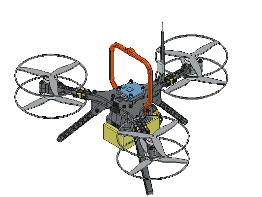

<!-- SPDX-License-Identifier: CC-BY-SA-4.0 -->

# COMET - Cost-efficient Open-Source Multicopter for Embedded-Systems Teaching

<div align="center">
    
</div>

<!-- https://github.com/badges/shields -->
<!--   -->
[](#oshwa-certification) [](#cite-this-work)

## Description

COMET is an open-source, cost-efficient Y6 hexacopter platform designed for education and research in embedded and cyber-physical systems. It features a fully 3D-printed, modular Y-frame with coaxial brushless DC motors and propellers that provide redundancy in propulsion. COMET also has a standardized motor-controller connector that allows for the easy integration of your preferred flight controller. This repository includes CAD sources, printable STL files, 3MF slicer projects, a bill of materials, a comprehensive build manual, and a ready-to-fly INAV configuration to ensure easy reproducibility.

Key specifications:
- Build it for less than $600 in total
- Frame size: 30cm
- Propellers: 5.1x2.5 (3 blades)
- Motors: 2004 1600KV-1900KV
- Power: 6S LiPo
- Recommended 3D printing materials: PC/CF for the frame and PETG for color coding.
- The recommended electronics are listed in the [bill of materials](/docs/bill_of_materials.ods).

## Table of Contents

- [Documentation](#documentation)
- [Repository Structure](#repository-structure)
- [Safety](#safety)
- [Releases and Versioning](#releases-and-versioning)
- [Licenses](#licenses)
- [Cite This Work](#cite-this-work)
- [OSHWA Certification (planned)](#oshwa-certification-planned)
- [Authors and Acknowledgment](#authors-and-acknowledgment)
- [Disclaimer](#disclaimer)

## Documentation

- Access the project website and documentation through: https://uastw-embsys.github.io/comet
- Latest release: https://github.com/uastw-embsys/comet/releases

Quick links:
  - Bill of Materials: [docs/bill_of_materials.ods](/docs/bill_of_materials.ods)
  - Printing guide: [docs/printing.md](/docs/printing.md)
  - Build manual: [docs/build.md](/docs/build.md)
  - FCU and ESC config: [docs/config.md](/docs/config.md)
  - Safety instructions: [docs/safety.md](/docs/safety.md)

[Back to the top &#8593;](#comet---cost-efficient-open-source-multicopter-for-embedded-systems-teaching)

## Repository Structure

In this repository, "mechanical" refers to printed parts, mechanical components, and assemblies, while "electronics" refers to commercial off-the-shelf (COTS) drone components, wiring, and configurations. According to the OSHWA definition, both are part of the “hardware”, but we separate them for clarity.

### Folders and Files

```
/
├── LICENSES/                            # Contains all licenses that are used
├── docs/
│   ├── assets/
│   │   ├── fonts/                       # Fonts used in the project
│   │   ├── images/                      # Pictures used in all Markdown files
│   │   └── renders/                     # Exported screenshots and animations
│   ├── assembly.md
│   ├── bill_of_materials.ods            # Detailed list of all parts needed
│   ├── build.md                         # Instructions for building COMET hardware
│   ├── config.md                        # Instructions for configuring COMET electronics
│   ├── index.md                         # Documentation landing page
│   ├── printing.md                      # Instructions for printing COMET hardware
│   └── safety.md                        # General drone/COMET safety instructions
├── electronics/
│   ├── esc/                             # Supported ESC configs (e.g., Bluejay)
│   │   └── bluejay/
│   │       └── configs/
│   │           └── <VERSION>/
│   │               ├── <TARGET>/        # YAML file documents all parameter values
│   │               │   ├── esc-configurator-*.png
│   │               │   └── parameters-*.yaml
│   │               └── README.md        # Description of how to configure ESCs
│   ├── fcu/                             # Supported FCU configs (e.g., INAV)
│   │   └── inav/
│   │       └── configs/
│   │           └── <VERSION>/
│   │               ├── <TARGET>/
│   │               │   └── diff-*.txt   # Contains all setting changes
│   │               └── README.md        # Description of how to configure the FCU
│   └── wiring/
│       └── wiring-diagram.svg           # Shows how components are connected and interfaced
├── mechanical/
│   ├── exports/                         # Generated artifacts (STEP and STL, do not edit)
│   ├── prints/                          # Supported slicer configs (e.g., PrusaSlicer)
│   │   ├── prusaslicer/
│   │   │   └── <PRINTER>/               # Printer-specific (e.g., COREONE) project files
│   │   │       └── <MATERIAL>/          # At least one folder named after the material(s) used
│   │   │       │   ├── clearance-gauge-*.3mf
│   │   │       │   ├── color-coding-*.3mf
│   │   │       │   └── frame-*.3mf
│   │   │       └── prusaslicer-bundle-Prusa<PRINTER>.ini
│   │   └── README.md
│   └── source/
│       ├── assemblies/                  # FreeCAD assemblies (A2plus workbench)
│       ├── calibration/
│       │   ├── clearance_gauge.FCStd
│       │   └── README.md
│       ├── macros/
│       │   ├── apply_parameters.py      # Apply part settings to FreeCAD parts
│       │   ├── common_fc.py
│       │   └── export_source.py         # FreeCAD export script
│       ├── part_parameters.yaml         # FreeCAD YAML parameter file
│       ├── parts/                       # FreeCAD part files (one Body per part)
│       └── README.md
└── README.md
```

### Source vs. Exports
The "source" (preferred form for modification) is under `mechanical/source/`. Generated artifacts (STL/STEP and 3MF) are under `mechanical/exports/` and `mechanical/prints/` after the use of `scripts/export_source.py`.

[Back to the top &#8593;](#comet---cost-efficient-open-source-multicopter-for-embedded-systems-teaching)

## Safety

Drones combine fast-spinning parts, high-energy batteries, and radio-controlled systems. Take a few simple precautions to reduce the risk of injury, equipment damage, and legal complications.

Treat setup and testing as seriously as flight:
- Remove propellers during INAV or Bluejay configuration and bench testing.
- Verify the motor spin direction and failsafes before putting propellers on.
- Follow local UAV regulations and only fly in permitted, safe areas within your line of sight.
- Handle LiPo batteries carefully and follow the best practices for charging and storing them.

Detailed **safety instructions** can be found in the [`docs/safety.md`](/docs/safety.md) file.

[Back to the top &#8593;](#comet---cost-efficient-open-source-multicopter-for-embedded-systems-teaching)

## Releases and Versioning

All releases use a semantic versioning scheme: MAJOR.MINOR.PATCH (e.g., v1.0.0).

Each release includes:
  - STEP and STL files for all printed parts
  - 3MF and INI project files for different 3D printers
  - PDF of the bill of materials
  - PDF of the documentation (e.g., build manual)
  - INAV and Bluejay configuration files

[Back to the top &#8593;](#comet---cost-efficient-open-source-multicopter-for-embedded-systems-teaching)

## Licenses

License application by content type:

- Hardware (e.g., CAD sources):  
CERN-OHL-W v2 - see [`LICENSES/LICENSE.CERN-OHL-W-2.0.txt`](/LICENSES/LICENSE.CERN-OHL-W-2.0.txt).
- Documentation (e.g., manuals or photos):  
CC BY-SA 4.0 - see [`LICENSES/LICENSE.CC-BY-SA-4.0.txt`](/LICENSES/LICENSE.CC-BY-SA-4.0.txt).
- Configuration Files (e.g., INAV or Bluejay):  
CC0-1.0 - see [`LICENSES/LICENSE.CC0-1.0.txt`](/LICENSES/LICENSE.CC0-1.0.txt).
- Software (e.g., scripts):  
LGPLv3 - see [`LICENSES/LICENSE.LGPL-3.0.txt`](/LICENSES/LICENSE.LGPL-3.0.txt).
- This project uses the Teko font, designed by Indian Type Foundry (2014), available under the SIL Open Font License, Version 1.1 - see [`docs/assets/fonts/teko/OFL.txt`](/docs/assets/fonts/teko/OFL.txt).

By contributing, you agree that your contributions are provided under the same licenses.

[Back to the top &#8593;](#comet---cost-efficient-open-source-multicopter-for-embedded-systems-teaching)

## Cite This Work

If you use or adapt the device for any academic or industrial purpose, especially if you publish it, please cite this repository and the relevant prior work.

### BibTeX repository
```bibtex
@misc{Comet_v1_0_0,
  author = {Christoph Böhm and Roman Beneder},
  title = {GitHub Repository: COMET - Cost-Efficient Open-Source Multicopter for Embedded Systems Teaching},
  year = {2026},
  howpublished = {\url{https://github.com/uastw-embsys/comet}},
  note = {DOI pending; version 1.0.0}
}
```

### BibTeX companion paper
```bibtex
@article{CometPaper2026,
  author  = {Christoph Böhm and Roman Beneder},
  title   = {COMET: Cost-Efficient Open-Source Multicopter for Embedded Systems Teaching},
  journal = {TechRxiv},
  volume = {2026},
  number = {0227},
  pages = {},
  year = {2026},
  doi = {10.36227/techrxiv.177222563.34103951/v1}
}
```

<!-- Once Zenodo is enabled and a release is archived, replace the “pending” text and add the Zenodo badge -->

[Back to the top &#8593;](#comet---cost-efficient-open-source-multicopter-for-embedded-systems-teaching)

## OSHWA Certification (planned)

- OSHWA UID: **Certification pending**; The planned certification UID (e.g., US000XXX) will be added here once approved. We plan to certify under OSHWA once v1.0.0 is released and the documentation is finished.
- This project complies with the Open Source Hardware Definition: https://www.oshwa.org/definition/
- Certification details and logo usage: https://certification.oshwa.org/

Interim Compliance Summary:

- Editable design files (FreeCAD .FCStd)
- Manufacturing files (STEP/STL)
- 3D print project files (3MF/INI)
- Bill of materials including standards and suppliers
- Build and configuration instructions (multiple manuals)
- Open licenses applied and documented

[Back to the top &#8593;](#comet---cost-efficient-open-source-multicopter-for-embedded-systems-teaching)

## Authors and Acknowledgment

### Authors (Credit roles in parentheses)

- [Christoph Böhm](https://scholar.google.com/citations?user=uV0KBoEAAAAJ) (Project initiator, developer, and maintainer)
- [Roman Beneder](https://embsys.technikum-wien.at/staff/beneder/index.php) (Project co-developer and test pilot)

Corresponding author: **Christoph Böhm** - christoph.boehm@ieee.org

### Contributors

- [Johannes Anderle](https://embsys.technikum-wien.at/staff/anderle/index.php)
- [Samuel Bauer](https://embsys.technikum-wien.at/staff/bauer/index.php)
- [Christian Fibich](https://embsys.technikum-wien.at/staff/fibich/index.php)
- [Ilva Heindl](https://embsys.technikum-wien.at/staff/heindl/index.php)
- [Ana Kokic](https://embsys.technikum-wien.at/staff/kokic/index.php)
- [Patrick Schmitt](https://embsys.technikum-wien.at/staff/schmitt/index.php)

### Acknowledgments

- [Research Group: Embedded Systems](https://embsys.technikum-wien.at/) for funding, workspace, and equipment
- We thank the open‑source communities whose software and content we rely on, including but not limited to:
  - FreeCAD and community workbenches
  - INAV flight software and INAV Configurator
  - Slicers used for supplied profiles (e.g., PrusaSlicer)
  - Icons and fonts used in this project
<!-- - This work was partially supported by <Grant/Company> (Grant no. XXX) -->

[Back to the top &#8593;](#comet---cost-efficient-open-source-multicopter-for-embedded-systems-teaching)

## Disclaimer
**This is experimental hardware. Use it at your own risk and comply with all local laws and regulations.**

[Back to the top &#8593;](#comet---cost-efficient-open-source-multicopter-for-embedded-systems-teaching)
