<!-- SPDX-License-Identifier: CC-BY-SA-4.0 -->

# Build Manual

## Table of Contents

- [Preparation](#preparation)
  - [Bill of Materials](#bill-of-materials)
  - [Tools](#tools)
  - [3D Print](#3d-print)
- [The Build](#the-build)
  - [Motor Block](#motor-block)
    - [MR30 Connector](#mr30-connector)
    - [Mounting the Motors](#mounting-the-motors)
    - [Mechanical Assembly](#mechanical-assembly)
  - [ESC Stack](#esc-stack)
    - [ESC Connector Cable](#esc-connector-cable)
    - [Combining ESCs](#combining-escs)
  - [Landing Gear](#landing-gear)
    - [Preparation of Parts](#preparation-of-parts)
    - [Mechanical Assembly](#mechanical-assembly-1)
  - [Battery Holder](#battery-holder)
    - [Preparation of Parts](#preparation-of-parts-1)
    - [Mechanical Assembly](#mechanical-assembly-2)
  - [RC Receiver](#rc-receiver)
    - [Connector Modification](#connector-modification)
    - [Preparation RC receiver](#preparation-rc-receiver)
    - [Mechanical Assembly](#mechanical-assembly-3)
  - [Y Frame](#y-frame)
    - [Preparation of Parts](#preparation-of-parts-2)
    - [Assembly top Mounting Plate](#assembly-top-mounting-plate)
    - [Assembly bottom Mounting Plate](#assembly-bottom-mounting-plate)
    - [Mechanical Assembly](#mechanical-assembly-4)
  - [Putting COMET together](#putting-comet-together)
    - [Adding the Landing Gear](#adding-the-landing-gear)
    - [Adding the Motor Blocks](#adding-the-motor-blocks)
    - [Adding the ESC Stack](#adding-the-esc-stack)
    - [Adding the Battery Holder](#adding-the-battery-holder)
    - [Adding the RC receiver](#adding-the-rc-receiver)
    - [Adding the Handle](#adding-the-handle)
  - [Final Checks](#final-checks)
- [Finished Build](#finished-build)

## Preparation

The first step is to prepare all the necessary parts and tools. This includes ordering materials, 3D printing the frame, post-processing the prints, and gathering the necessary tools.

[Back to the top &#8593;](#table-of-contents)

### Bill of Materials

The [bill of materials](/../bill_of_materials.ods) lists all the necessary parts and their locations on COMET. The *shopping list* register shows the quantity of each part needed, and the source column indicates where the parts can be ordered.

[Back to the top &#8593;](#table-of-contents)

### Tools

The following is a list of the tools needed to build COMET:
- length ruler (from the 3D-printed frame parts)
- side cutter
- nose plier
- soldering iron, solder, and flux
- 1.5mm allen key
- 2.5mm allen key
- 5.5mm open-jaw wrench
- tweezers
- zip ties (different sizes)
- shrinking tube (different sizes)
- (optional) cable striper
- (optional) threaded inserts melting [aid set](https://www.3djake.com/ruthex/soldering-tips-melting-aid-set?similar_products_d_a=30899)

[Back to the top &#8593;](#table-of-contents)

### 3D Print

ADD THE CALIBRATION PROCEDURE!

In the [prints/](/../../mechanical/prints/) (computer-aided manufacturing) folder, select the printer that will be used to print the frame and/or accessory components. These folders contain the project files for the slicing software (converting 3D models into 3D printable objects). The print files are located in the printer's *gcode folder*. Select the appropriate material. The files named *comet_single_plate_...* refer to the complete frame; *comet_propeller_guards_...* are for printing a set of propeller guards only; and *comet_color-coding_accessories_...* are for printing non-functional pieces to distinguish between different setups.

    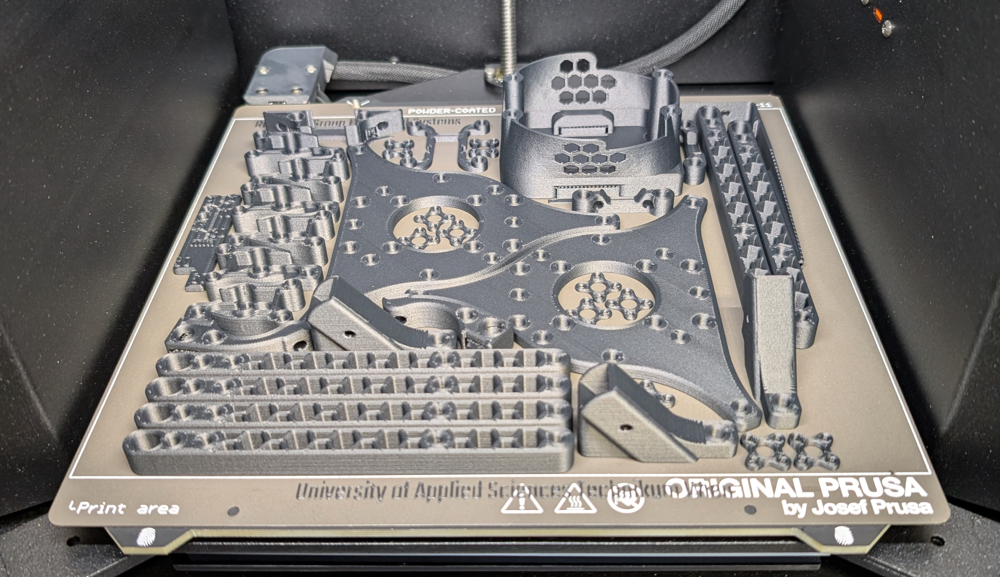
    
Fig. 1. The finished 3D-printed frame parts were produced using our research group's Prusa CORE One 3D printers. This build plate contains all the parts needed to assemble COMET.

The 3D-printed frame requires the removal of support structures before proceeding. This concerns components battery holder (BH-01), XT30 connector mounts (YF-03), and ESC connector mount (YF-04). The figure below highlights these structures, which can be detached by applying a small amount of force with nose pliers.

    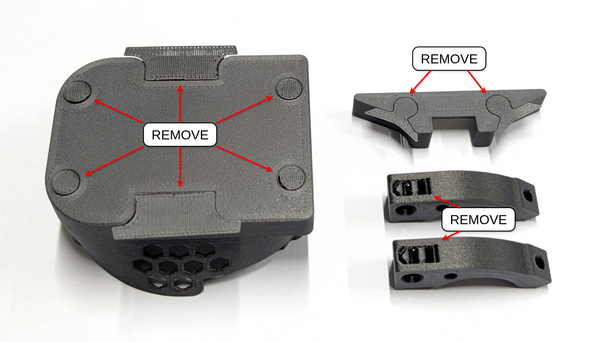
    
Fig. 2. Spots where the supports need to be removed.

Additionally, the 3D print includes a ruler to measure the size of all the screws used in the build. Use it to ensure that you use the proper size screw for the task at hand.

    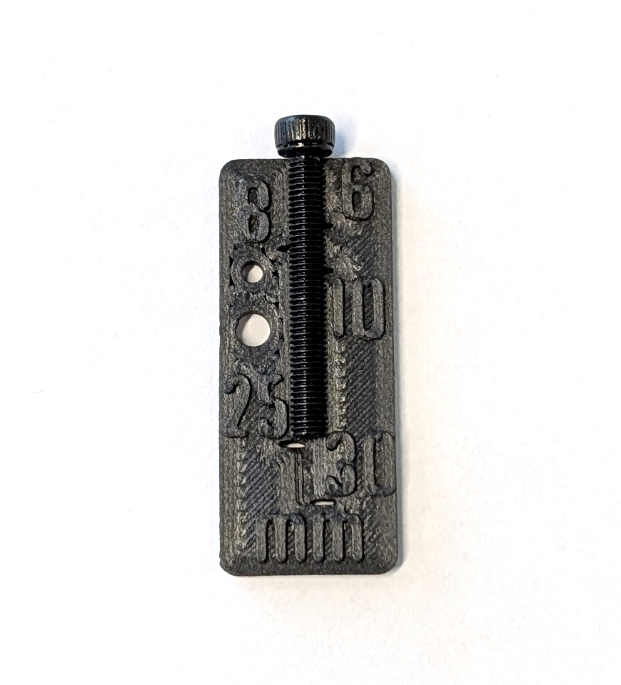
    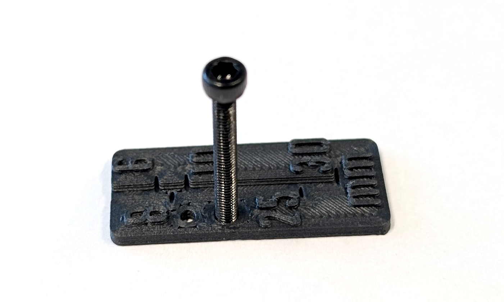
    
Fig. 3. Here is an example of how to measure the length (left) and diameter (right) of a screw.

[Back to the top &#8593;](#table-of-contents)

## The Build

At the beginning of the assembly process, gather all the necessary components and tools. The assembly process is divided into subgroups that come together to form the complete drone.

    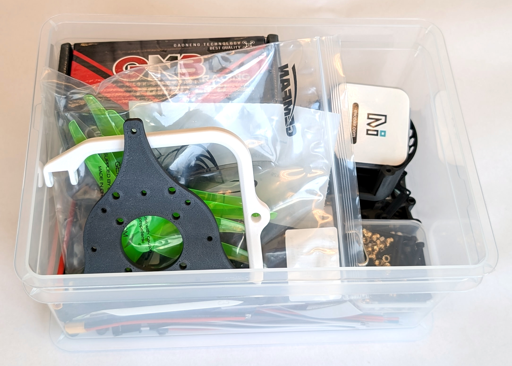
    
Fig. 4. Pre-built student kit for the EDUCON 2026 paper submission. The displayed parts may differ from the latest version of COMET.

[Back to the top &#8593;](#table-of-contents)

### Motor Block

To assemble a full hexacopter setup in a Y configuration, three motor blocks are required. These connect the motors and propellers to the drone, making it possible to control the aircraft. All parts for this subgroup are labeled with the prefix "MB-*" in the [bill of materials](./bill_of_materials.ods). The following steps show how to assemble one motor block.

    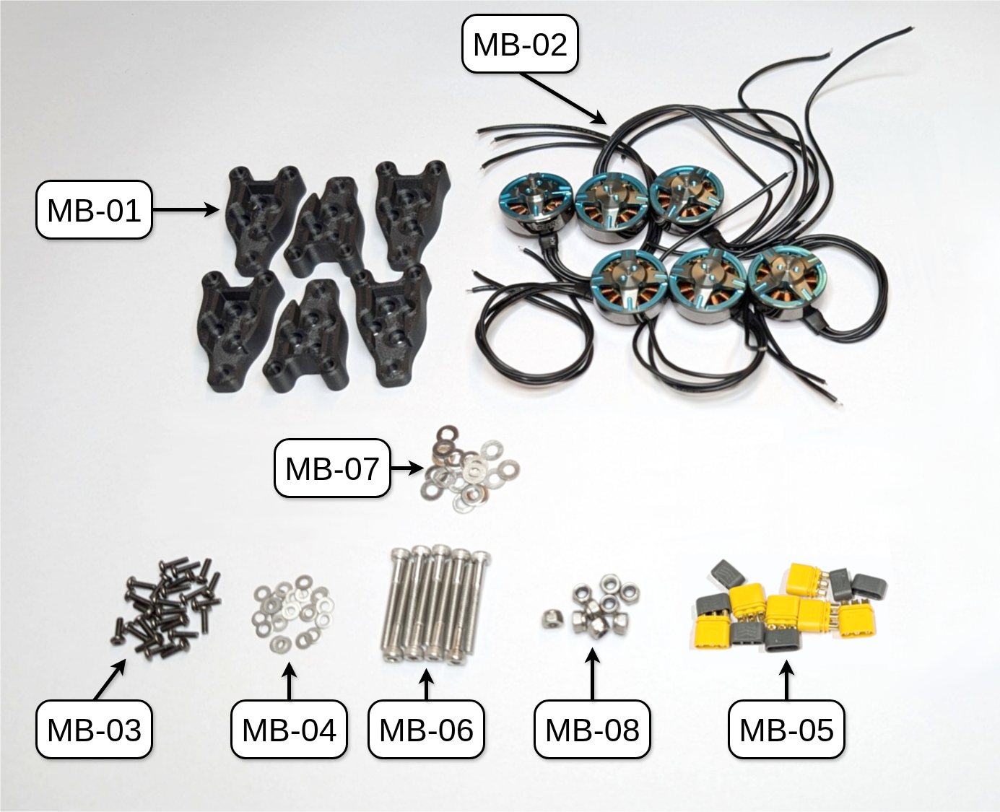
    
Fig. 5. All parts needed to build the three motor blocks of COMET.

[Back to the top &#8593;](#table-of-contents)

#### MR30 Connector

All brushless DC (BLDC) motors are connected to their respective electronic speed controllers (ESCs) via MR30 connectors, which are common in the drone community. First, attach the male MR30 connectors (MB-05, the ones with the pins inside the connector) to the BLDC motors (MB-01). Then, use a measuring tape or the supplied length ruler to cut the motors' cables to a length of around 5cm from the motor hub.

    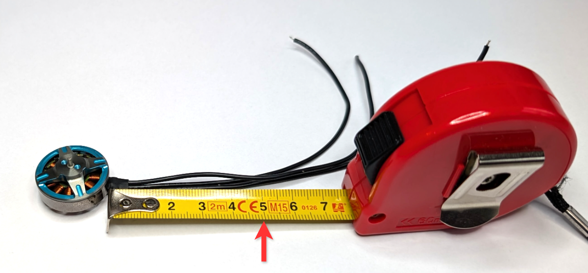
    
Fig. 6. Cut each motor cable to a length of around 5cm.

After cutting the cables to the appropriate length for each motor, remove approximately 3mm of insulation from each cable and apply solder to the exposed copper wire.

    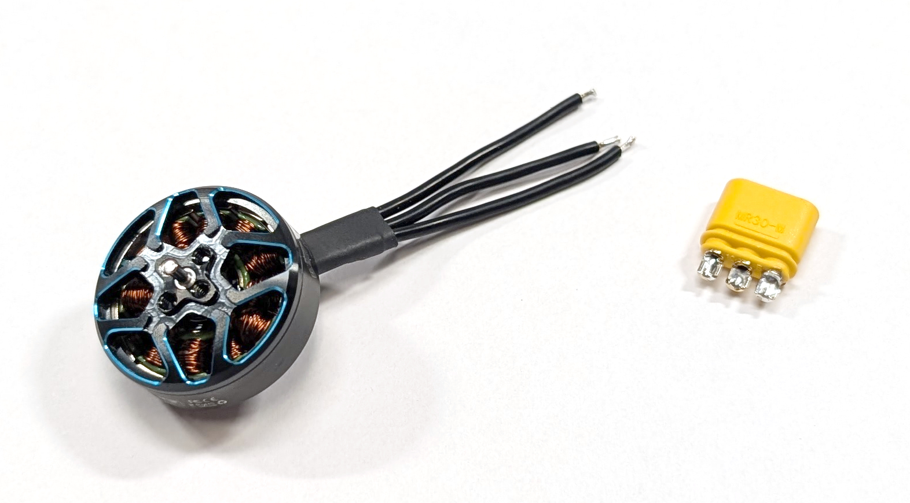
    
Fig. 7. One motor with three exposed copper wire and pre-applied solder.

After completing the previous step, insert the three motor cables through the solder cover (the gray piece) of the male MR30 connector (MB-05). Then, apply a small amount of solder to the solder cup (the yellow or orange piece) of the connector. Next, align one of the exposed pieces of each motor wire with a solder cup on the connector and solder them together. Make sure there are no shorts between the wires or connectors. The order of the cables does not matter because the spin direction of the motor can be set either in software or by physically switching two cables (BLDC phases) at the ESC. The latter option will be explained further in a later section.

    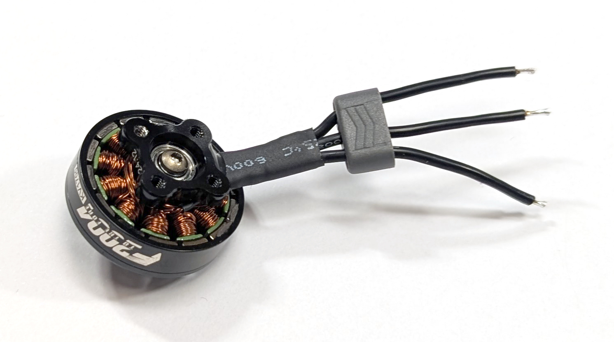
    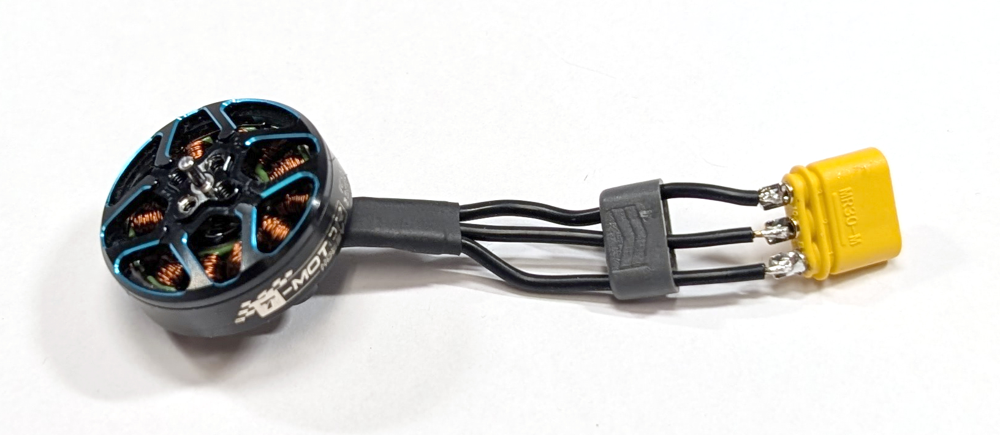
    
Fig. 8. (left) One motor with its wires put through the solder cover and (right) these wires soldered to the male MR30 connector.

Test the solder joint by gently pulling on the connector and cable. Then, push the solder cover onto the connector until it clicks into place.

    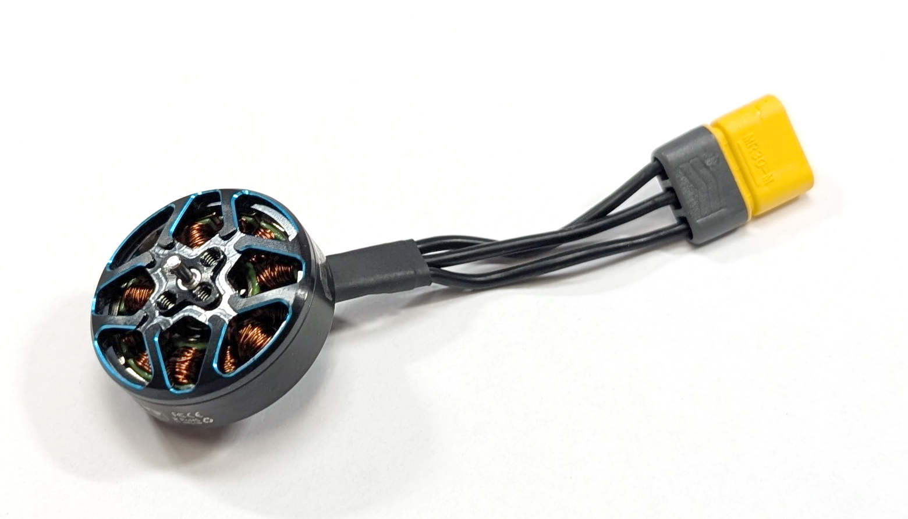
    
Fig. 9. One BLDC motor electrically wired.

Put the propellers (MB-09) and M2 x 8mm screws (MB-10) aside for later propeller mounting.

[Back to the top &#8593;](#table-of-contents)

#### Mounting the Motors

After attaching the male MR30 connectors to the BLDC motors, assemble the motor blocks. Begin with the six motor block halves. Mount the BLDC motor (MB-02) to the motor mount (MB-01) using the M2 x 5mm screws and washers (MB-03 and MB-04). If the motors only come with M2 x 6mm or M2 x 7mm screws, add an appropriate motor mount spacer between the motor and the mount. Ensure that the BLDC motor aligns with the mounting holes, allowing its cables to angle slightly to the left (see Fig. 10, right image). Before tightening the screws, verify that they do not touch the motor windings. All steps are depicted in Fig. 10 for clarity. Figure 11 shows an assembled motor block half for reference.

    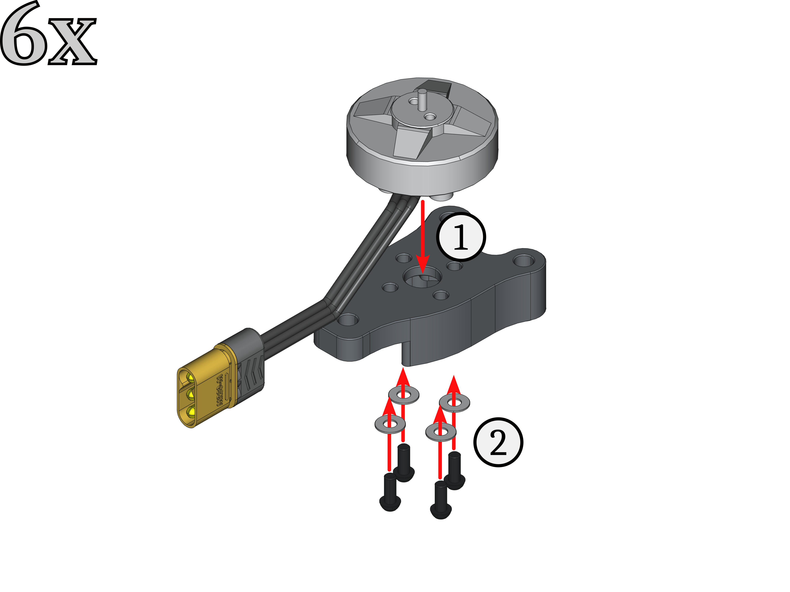
    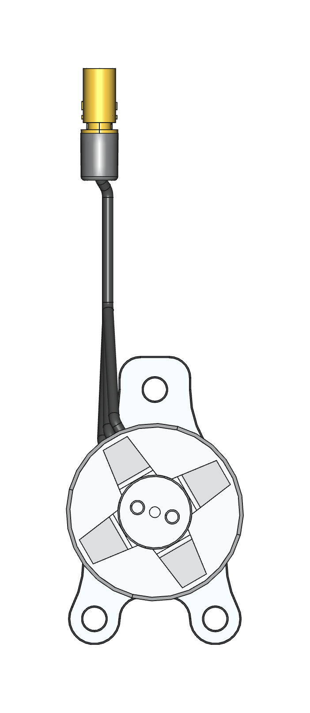
    
Fig. 10. (left) Assembly steps for one motor block half, with (right) the cables angling slightly to the left.

    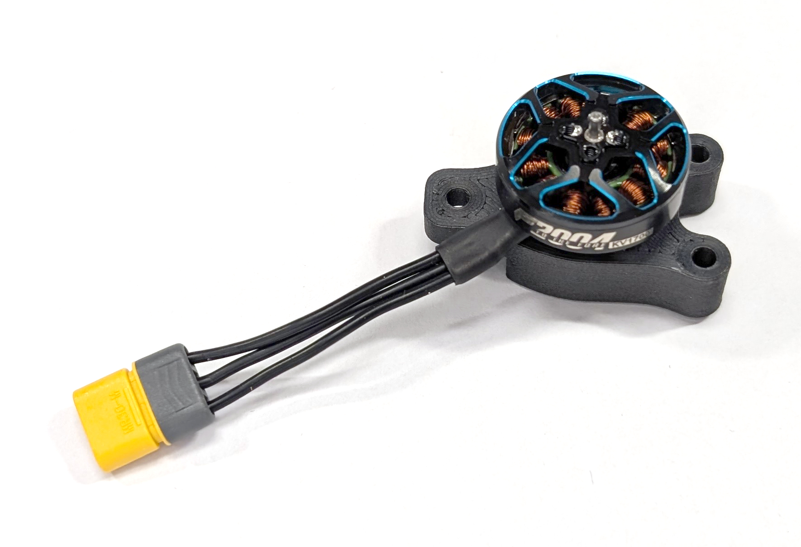
    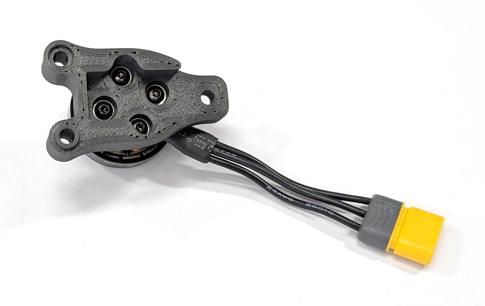
    
Fig. 11. One assembled motor block half: (left) top view; (right) bottom view.

[Back to the top &#8593;](#table-of-contents)

#### Mechanical Assembly

Next, take two motor block halves and screw them together using two M3 x 25mm screws (MB-06), four M3 washers (MB-07), and two M3 self-locking nuts (MB-08). All involved steps are depicted in Fig. 12. These steps need to be repeated three times, resulting in three fully assembled motor blocks ready for use.

    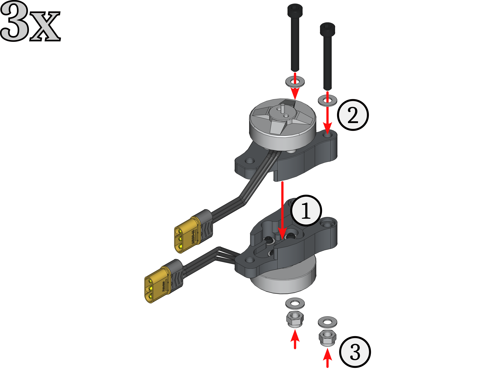
    
Fig. 12. Assembly steps to put two motor block halfs together.

    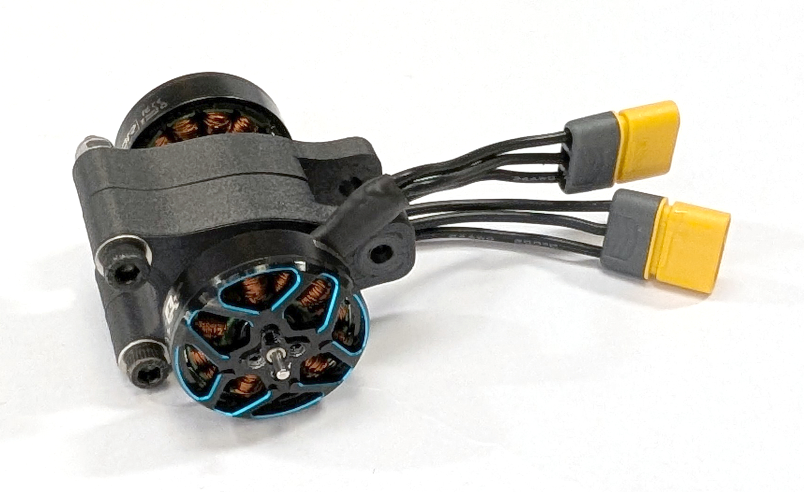
    
Fig. 13. One fully assembled motor block.

Store the remaining M3 x 25mm screws (MB-06), M3 washers (MB-07), and M3 self-locking nuts (MB-08) for the final assembly.

[Back to the top &#8593;](#table-of-contents)

### ESC Stack

Electronic speed controllers (ESCs) are vital components of the drone because they control the BLDC motors and keep the drone airborne. These ESCs are accessible via a standardized IDC connector connected to the FCU, which supplies power to the FCU too. All parts for this subgroup are labeled with the prefix "ES-*" in the [bill of materials](./bill_of_materials.ods). The following steps illustrate how to assemble the COMET ESC stack. If the ESCs do not have rubber vibration dampers, install them first, placing the short end on the JST connector side!

    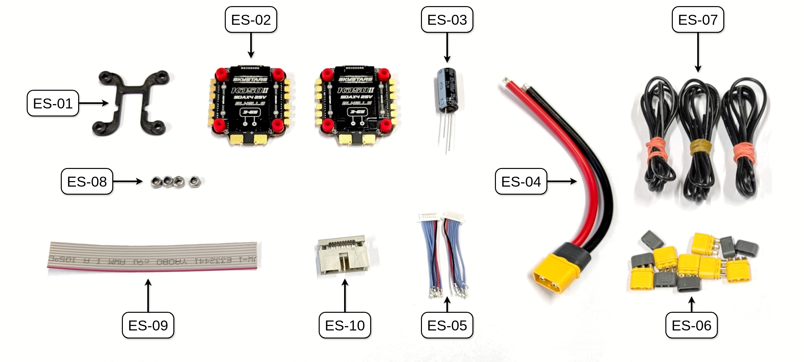
    
Fig. 14. All parts needed to build the ESC stack.

[Back to the top &#8593;](#table-of-contents)

#### ESC Connector Cable

First, we need to manufacture the ESC cable that connects both ESCs through the JST SH connectors with the FCU. The ESC closer to the capacitor and mounting plate is called ESC #1, and the one below it is called ESC #2 (as indicated with the positioning in Fig. 15).

    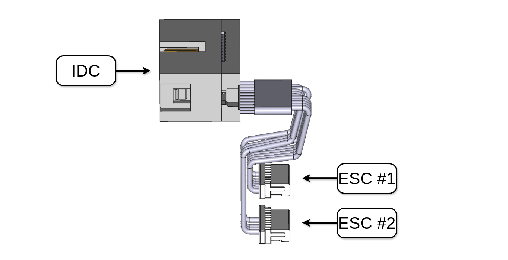
    
Fig. 15. Reference for the ESC connector cable.

Fig. 16 shows the pinouts for the COMET IDC connector (ES-10) and the JST SH connector of the chosen [Skystars KO50A BLS](https://www.rotorama.de/product/skystars-ko50a-bls) 4-in-1 ESCs (ES-05). Attention: Make sure you have the correct pinout for your ESC connector because the current measurement pin and N.C. (or telemetry signal) may be switched in some cases. This is the case for [SpeedyBee](https://www.speedybee.com/speedybee-f405-bls-50a-30x30-4-in-1-esc) ESCs. Please refer to the respective user manuals for more information!

    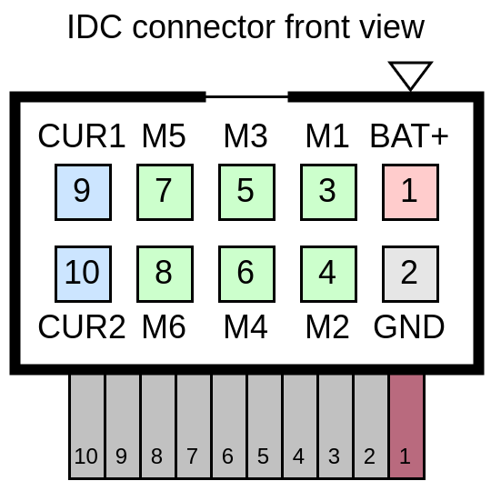
    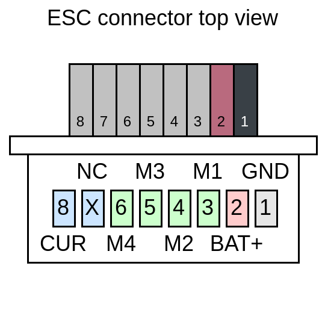
    
Fig. 16. (left) IDC connector pinout of COMET and (right) 4-in-1 ESC JST connector pinout of our chosen ESC.

Now, prepare the ESC cables for soldering. If you have never modified JST SH connectors before, this [tutorial video](https://www.youtube.com/watch?v=za-azgbZor8) may be helpful. For ESC #1, remove the cables for the fourth motor and the NC one (wires 6 and 7). For ESC #2, remove the cables for the battery (BAT+), ground (GND), the fourth motor (M4), and the NC one (wires 1, 2, 6, and 7). Battery and ground will be shared through the power connection.

    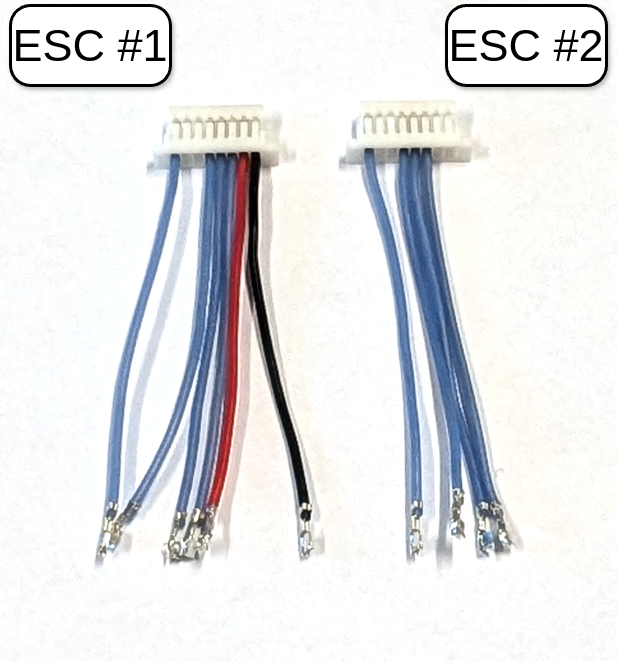
    
Fig. 17. Modified connectors for ESC #1 and ESC #2.

Take the two modified ESC connector cables and the ribbon cable (ES-09). First, cut the ESC connector cables to a length of approximately 3cm. Then, remove about 5mm of insulation from each cable end and apply solder. Place shrink tubes (approximately 10mm long each) over all of the wires of the ESC connectors to later prevent shorts. Solder the ESC connector wires to the ribbon cable wires according to Tab. 1. If you have access to a multimeter with conductivity measurement, check if all signals connect to the right pins.

    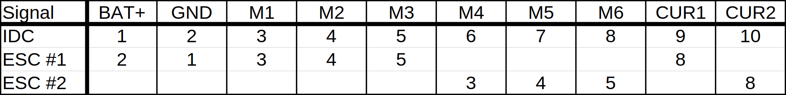
    
Tab. 1. ESC connector wiring overview.

    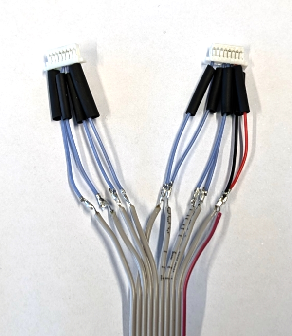
    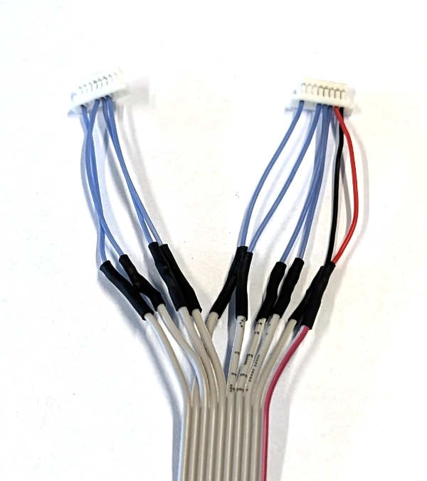
    
Fig. 18. (left) ESC connector wires soldered together; (right) shrink tubes insulating solder joints.

Cut the resulting cable to a length of approximately 6 cm, measured from the front of the ESC connectors.

    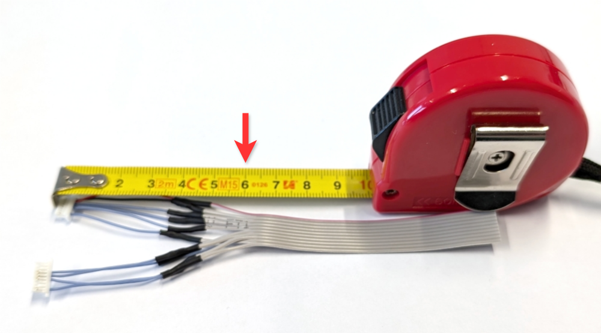
    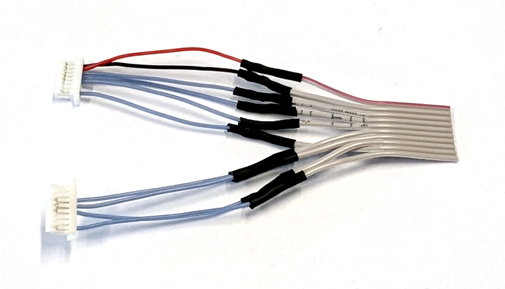
    
Fig. 19. Cutting the connector cable to length (indicated by the red arrow).

The final step is to insert the cut end of the ribbon cable into the IDC connector, aligning the red wire with the arrow on the connector. Then, close the IDC connector and pay attention to the click.

    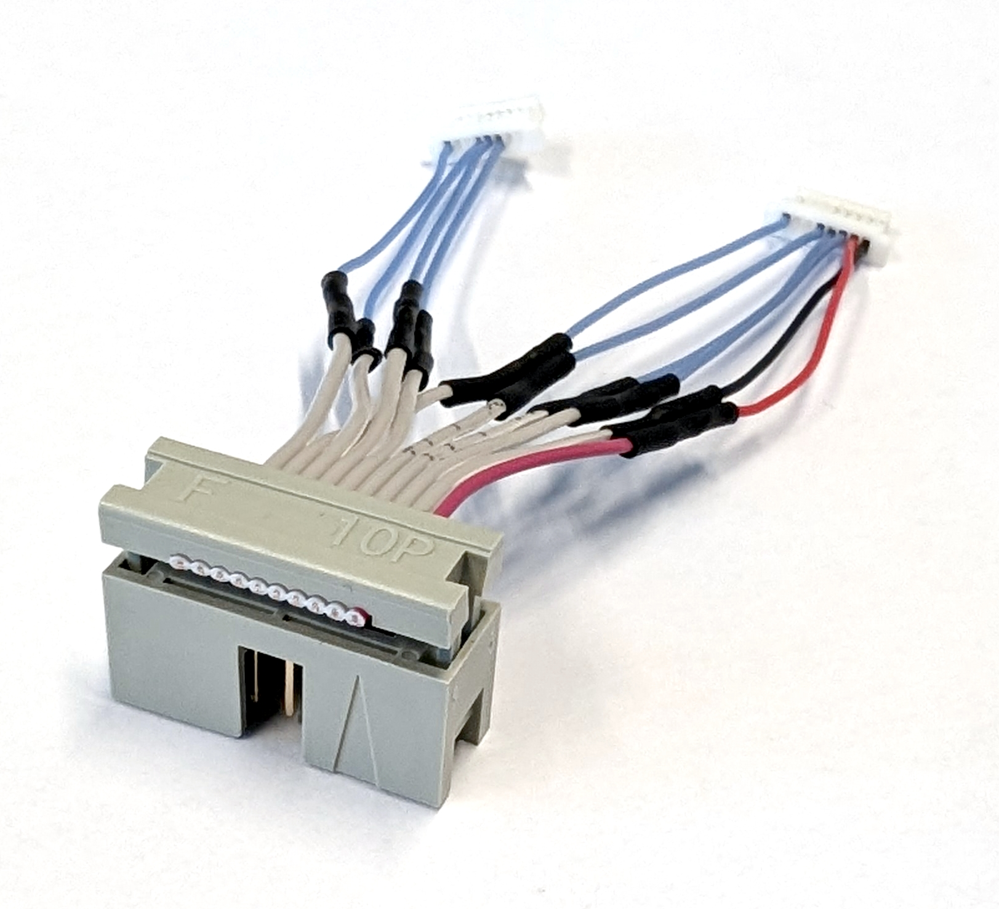
    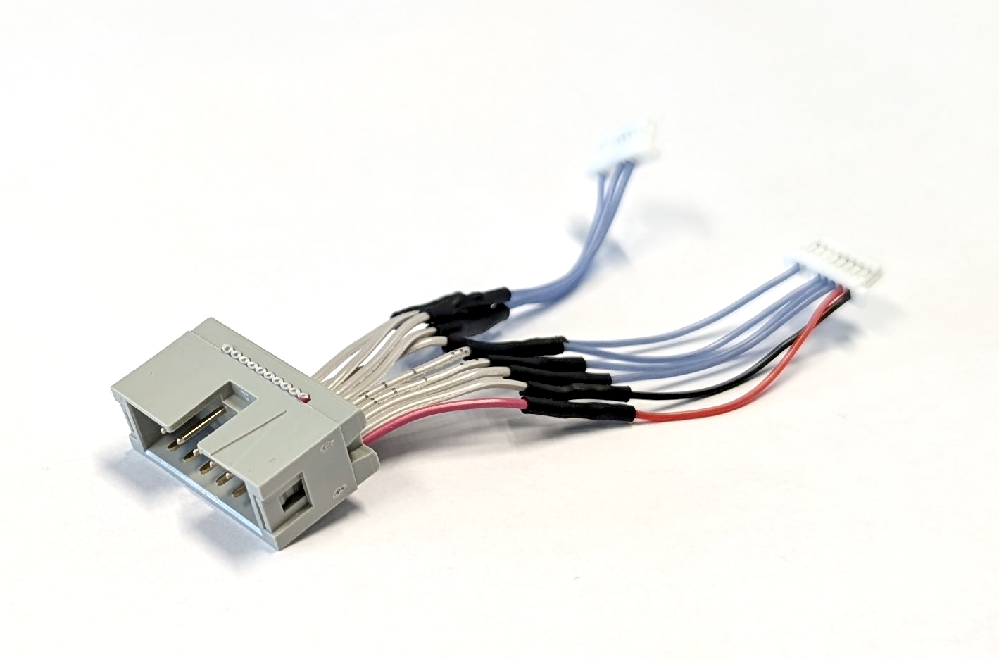
    
Fig. 20. (left) Alignment of the ribbon cable. (left) Fully assembled ESC connector cable.

Do not connect the assembled ESC connector cable to the ESC yet. Store it for final assembly.

[Back to the top &#8593;](#table-of-contents)

#### Combining ESCs

Begin assembling the ESC stack by cutting the silicone cables (ES-07) into 18 equal pieces, each 15cm long. Save the remaining cables as spares. Remove approximately 3mm of insulation from one side of each cable and apply solder to the exposed copper wire. Then, solder the motor cable strands to the pads of motors 1, 2, and 3 for both ESC #1 and ESC #2. Each ESC should now have nine motor cables attached to it. To make the final assembly easier, label the motor connector cable on ESC #1 from M1 to M3, and label the motor connector cable on ESC #2 from M4 to M6.

    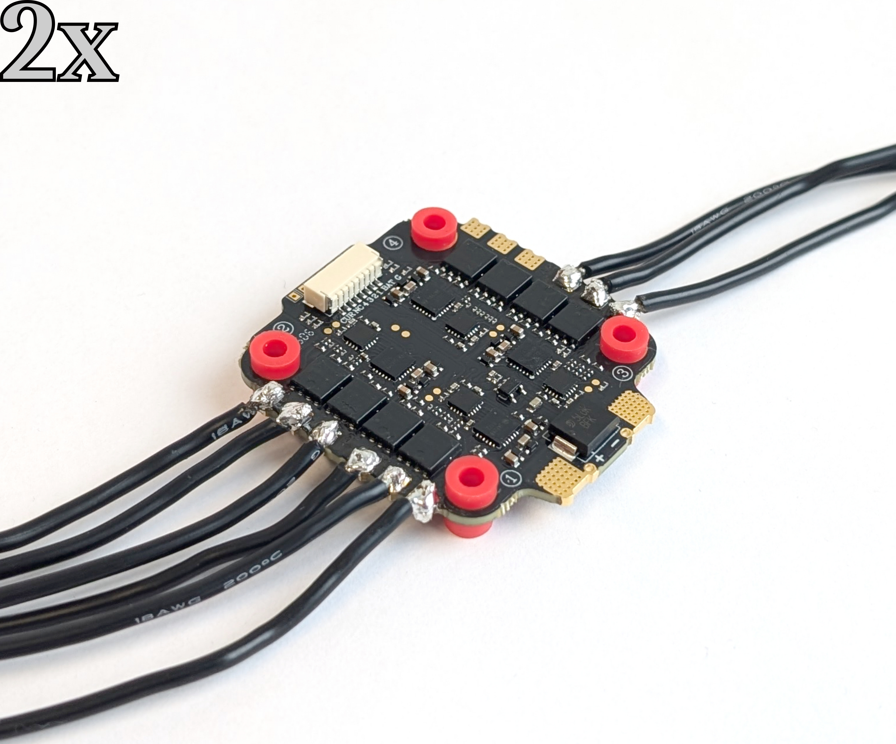
    
Fig. 21. Soldered motor cables to the pads of motors 1, 2, and 3 on one ESC.

Use the M3 x 30mm (YF-11) screws from the later-assembled Y frame to properly align both ESCs and assemble the stack. Insert the screws through the rubber vibration dampers, ensuring that the JST connector side of each ESC faces down and the longer side of the dampers faces up. Secure the stack with the M3 self-locking nuts (ES-08). The top ESC is now referred to as #1, and the bottom one is referred to as #2.

Use a spare XT60 power cable to connect the positive and negative power pads of both ESCs. Strip 15 mm of insulation from the cable to expose the wire, then apply solder. Solder the wire to the pads to connect both ESCs, then trim any excess wire. Note that these power pads take time to heat up and require a great deal of power!

    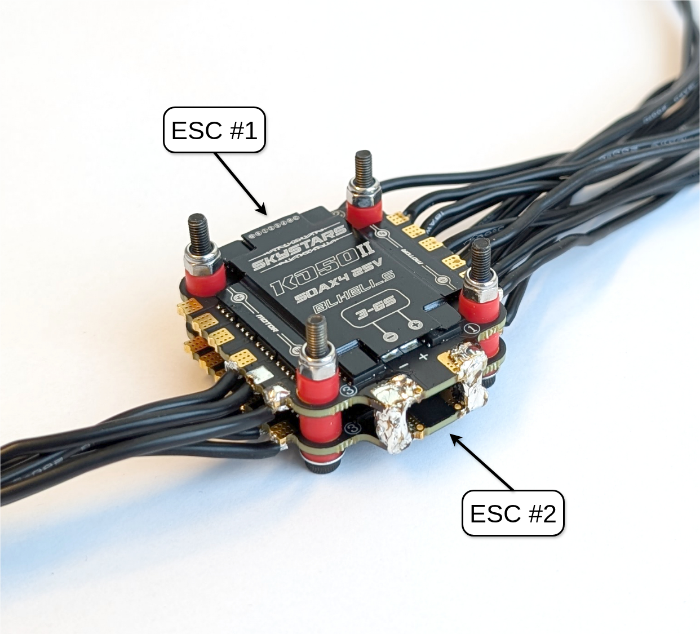
    
Fig. 22. The power pads are connected between ESC #1 and ESC #2.

Next, attach the XT60 battery connector (ES-04) to the stack. First, remove 5 mm of insulation from the wires, then apply solder. Afterwards, solder the prepared XT60 battery connector perpendicular to the power wires between ESC #1 and ESC #2 as illustrated in Fig. 23.

    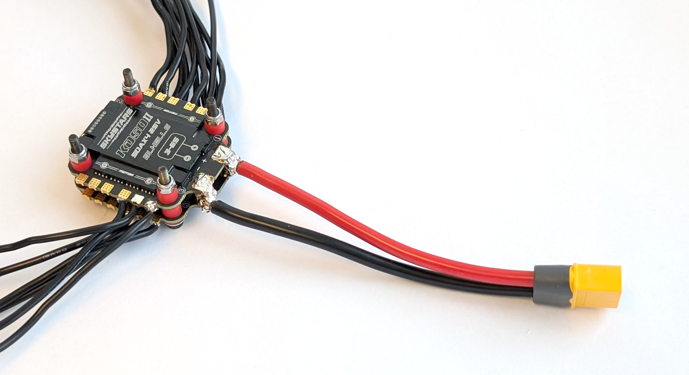
    
Fig. 23. Connected XT60 battery connector to the ESC stack.

Remove the M3 self-locking nuts from the stack, then place the capacitor holder (ES-01) on top of ESC #1, aligning its standoffs with the ESC. Check the polarity of the power pads on the ESC, then correctly insert the capacitor (ES-03) into the holder. Bend its legs so that they can be inserted into the associated through hole via. Refer to the ESC manual for the location of the capacitor's soldering point. Secure the capacitor in place with a zip tie, then solder it to ESC #1.  

    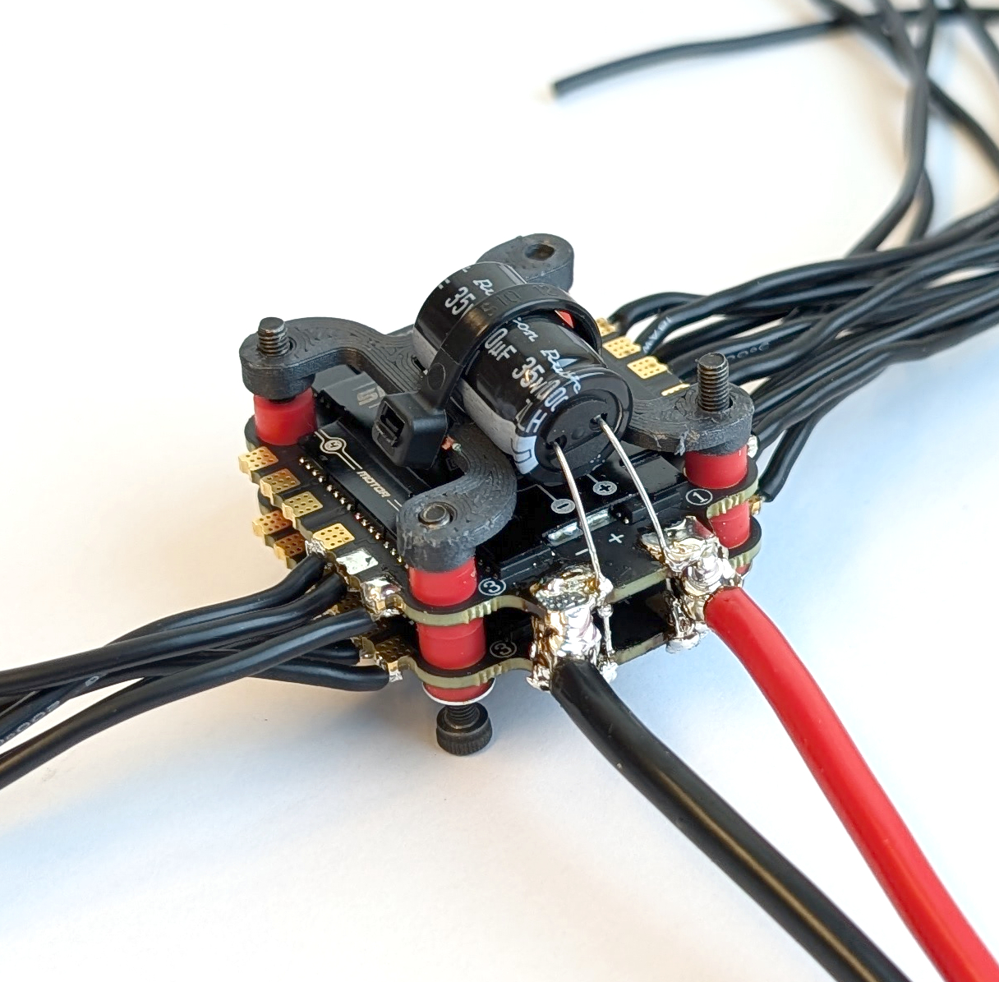
    
Fig. 24. The ESC stack with the added capacitor and its holder.

    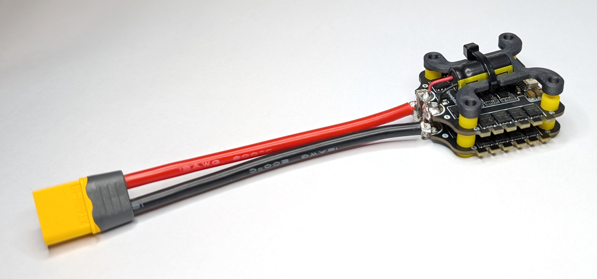
    
Fig. 25. One fully assembled ESC stack.

Store the M3 self-locking nuts (ES-08) for the final assembly.

[Back to the top &#8593;](#table-of-contents)

### Landing Gear

The landing gear is an important part of a drone because it ensures stability before take off. Three contact points are sufficient for stability, so this hexacopter with a Y configuration only needs three landing gear legs. Note that the rotor arms serve as legs, reducing the complexity and number of 3D-printed parts. All parts for this subgroup are labeled with the prefix "LG-*" in the [bill of materials](./bill_of_materials.ods). The following steps show how to assemble one landing gear.

    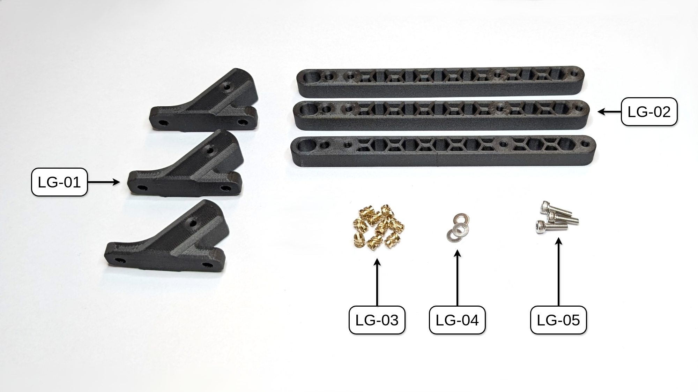
    
Fig. 26. All parts needed to build the three landing gears of COMET. NOTE: UPDATE IMAGE

[Back to the top &#8593;](#table-of-contents)

#### Preparation of Parts

Thread inserts will be used throughout the build for easier assembly. These inserts are melted into the 3D-printed parts using a soldering iron with optional melting-aiding tips (see the tool list). If you have never worked with these type of threaded inserts before, this [tutorial video](https://www.youtube.com/watch?v=P7nHyI1TwKY) may be helpful. A note on the video: We achieved the best results with a temperature 15°C above the 3D printing temperature. For example, PC CF is printed at 290°C; therefore, the temperature should be set to 305°C. After setting the correct temperature, align the threaded inserts (LG-03) with the holes in the rotor arms (LG-02) and landing gear mounts (LG-01). 

    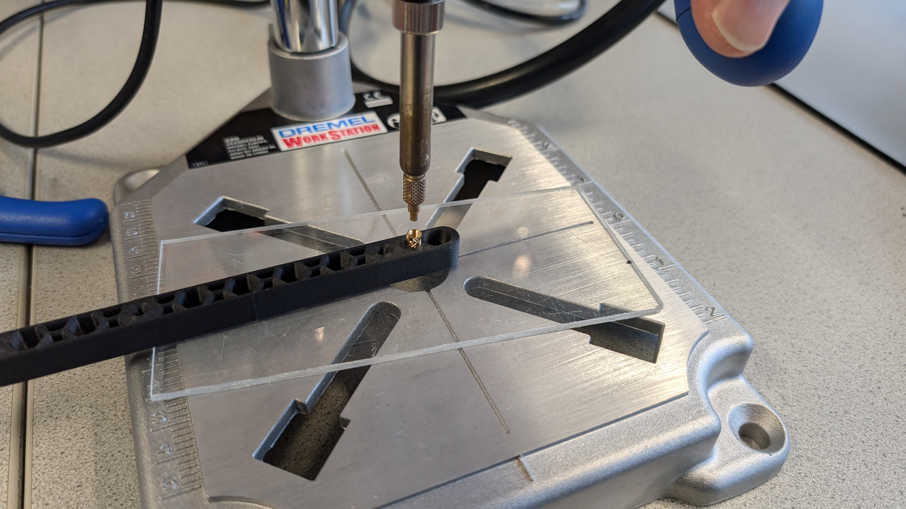
    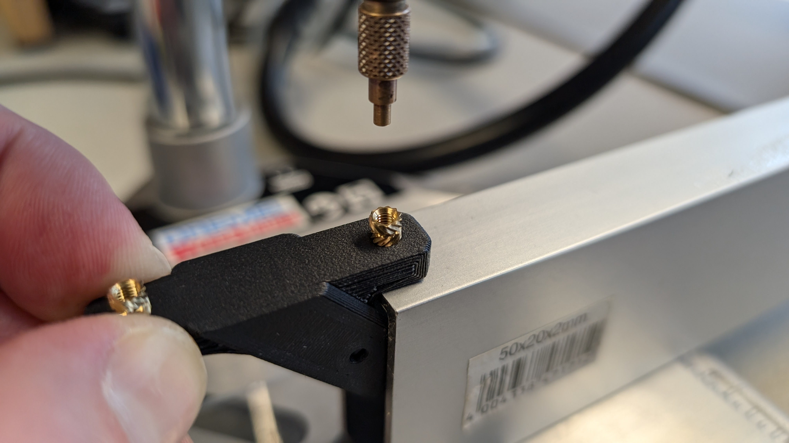
    
Fig. 27. Examples of how to best align the thread inserts for the rotor arms (left) and landing gear mounts (right). NOTE: UPDATE RIGHT IMAGE

Hold the soldering iron tip against the insert. Once the insert is heated up, push it into the part until it is flush with the surface. During this procedure, keep the soldering iron perpendicular to the surface to ensure the inserts are not at an angle. Note that the inserts and the surrounding plastic will get hot and need to cool down.

    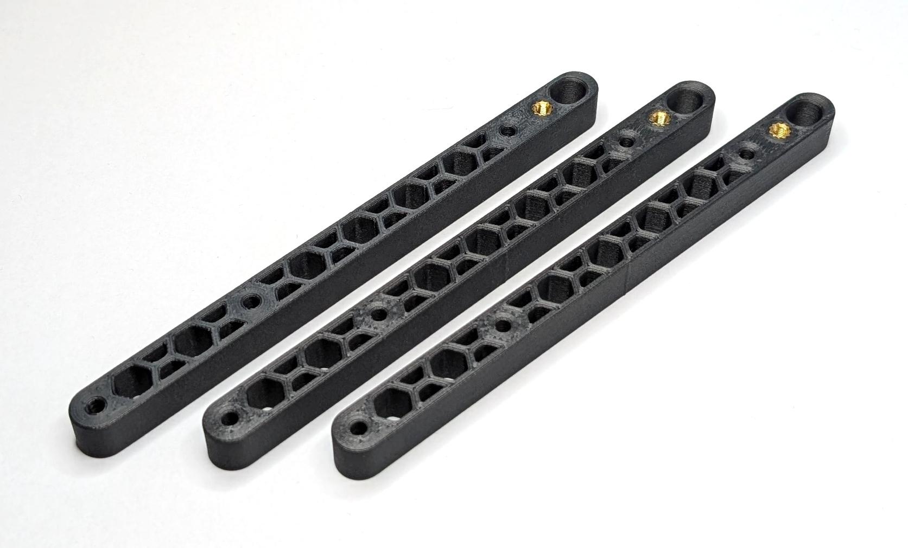
    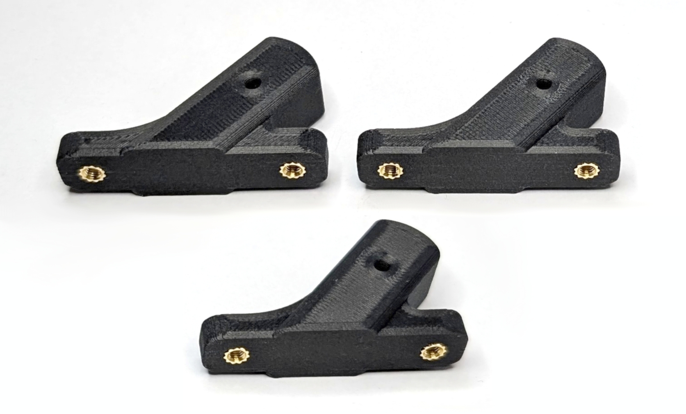
    
Fig. 28. Prepared rotor arms (left) and landing gear mounts (right). NOTE: UPDATE RIGHT IMAGE

[Back to the top &#8593;](#table-of-contents)

#### Mechanical Assembly

Put the rotor arm (LG-02) into the landing gear mount (LG-01) and secure it with an M3 x 10mm screw and washer (LG-05 and LG-04). Repeat these steps three times to assemble all landing gears.

    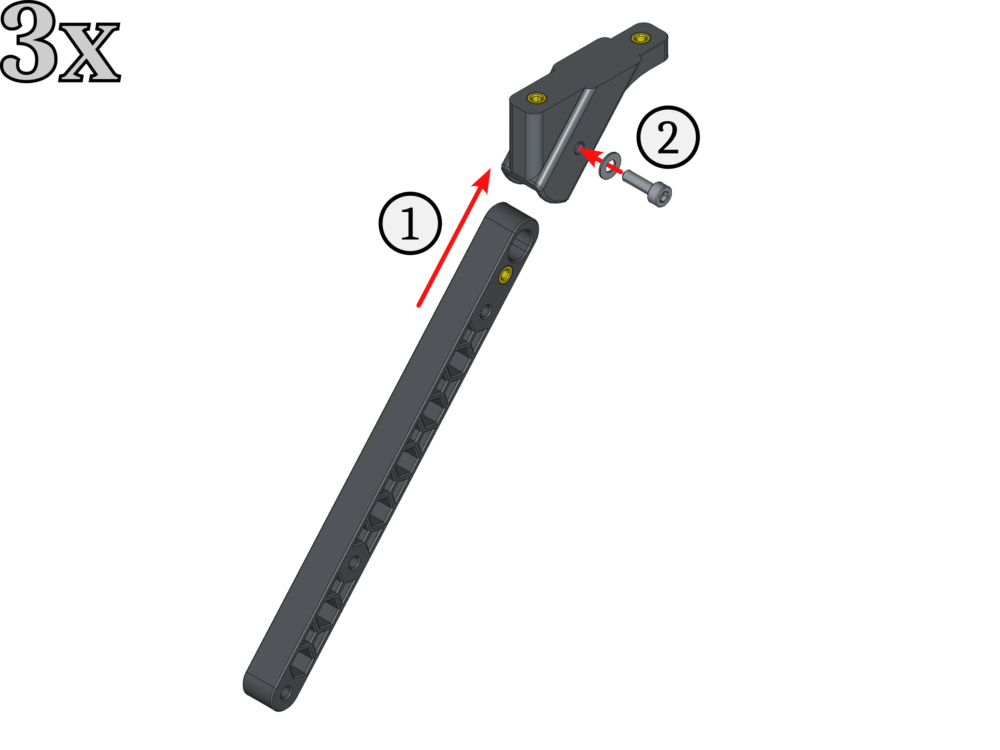
    
Fig. 29. Assembly steps for one landing gear leg.

    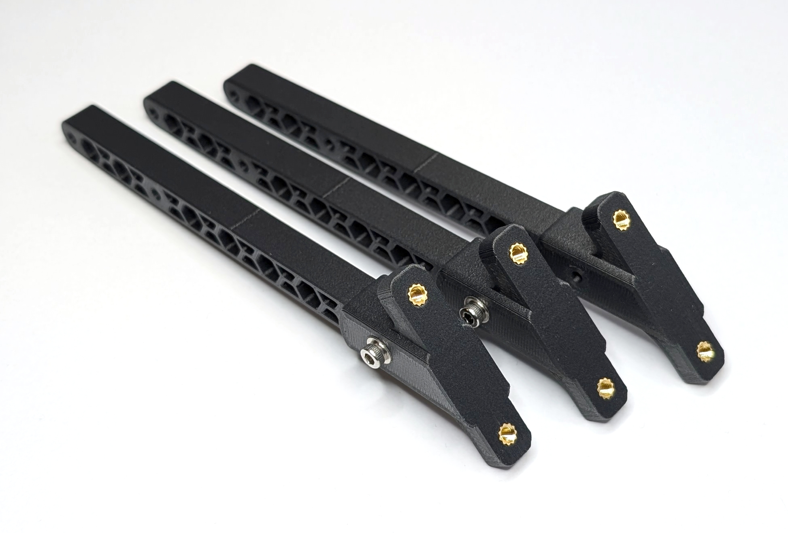
    
Fig. 30. All three assembled landing gear legs. NOTE: UPDATE IMAGE

[Back to the top &#8593;](#table-of-contents)

### Battery Holder

This subgroup holds the battery that powers the entire drone. All parts for this subgroup are labeled with the prefix "BH-*" in the bill of materials. The following steps show how to assemble the battery holder.

    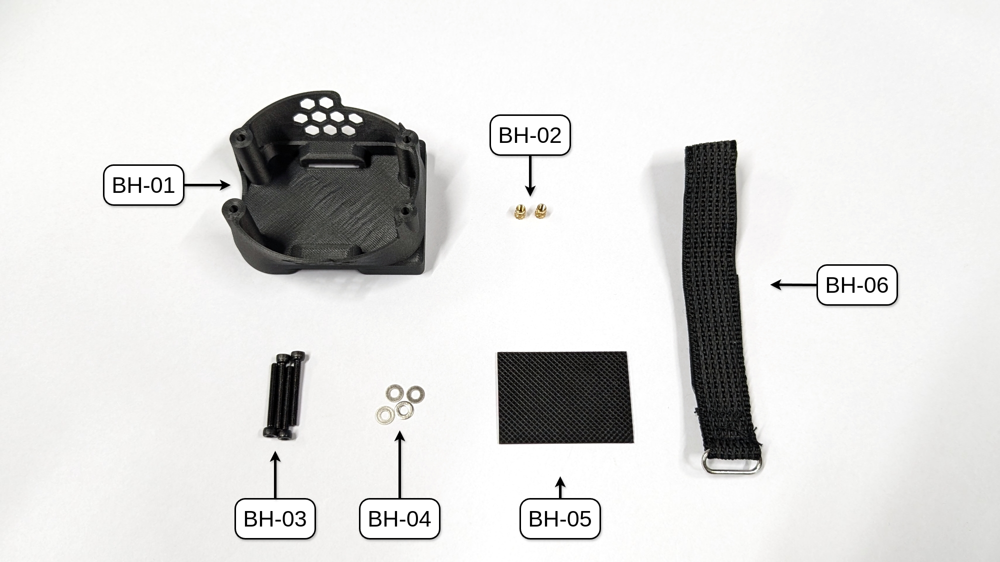
    
Fig. 31. All parts needed to assemble the battery holder of COMET.

[Back to the top &#8593;](#table-of-contents)

#### Preparation of Parts

To prepare the battery holder (BH-01) for assembly, melt the two thread inserts (BH-02) into the holes to the left and right of the text "COMET." Again, ensure that the inserts are perpendicular to the surface and that the correct temperature is selected (e.g., PC CF at 305°C).

    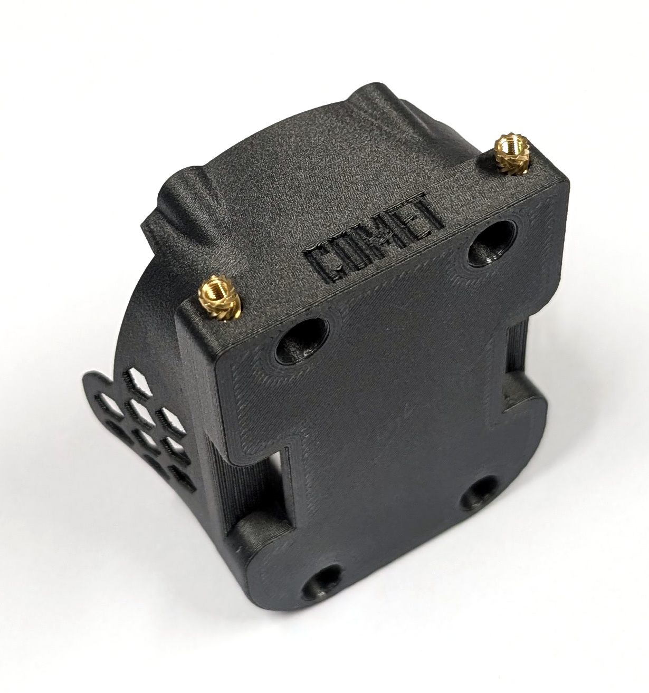
    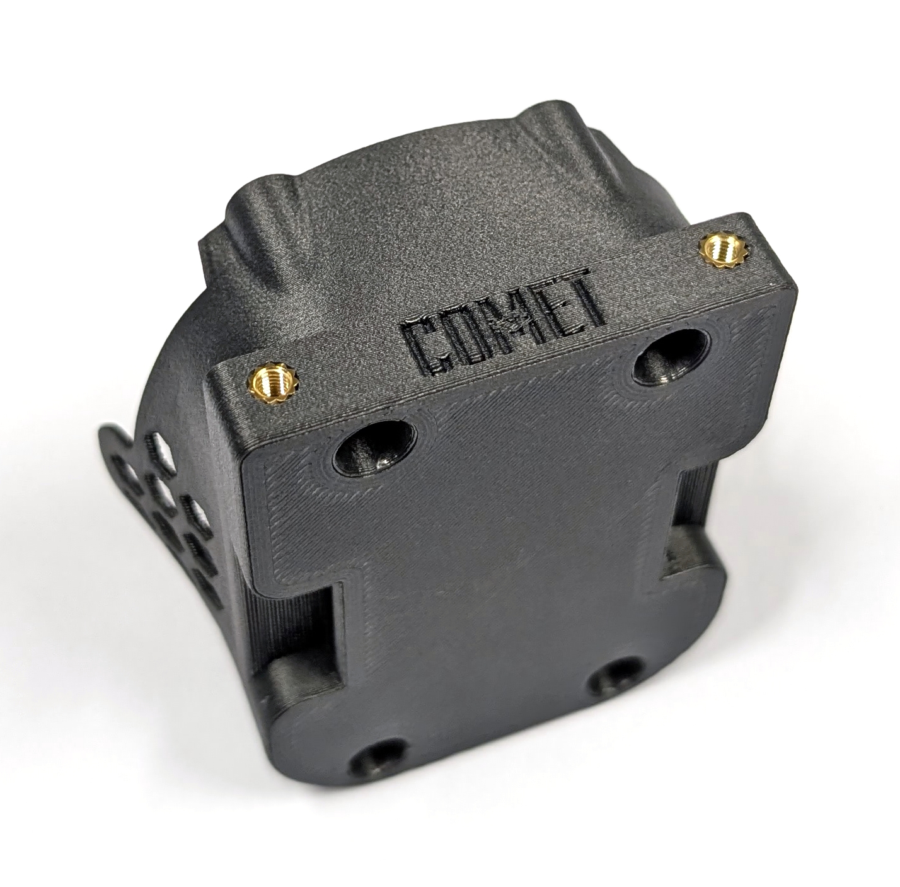
    
Fig. 32. Preparation of the thread inserts (left) and finished preparation of the battery holder (right).

[Back to the top &#8593;](#table-of-contents)

#### Mechanical Assembly

To assemble this subgroup, stick the silicone pad (BH-05) centered to the bottom of the battery holder. Then, thread the battery strap (BH-06) through the openings on the bottom of the battery holder (see Fig. 28 for reference).

    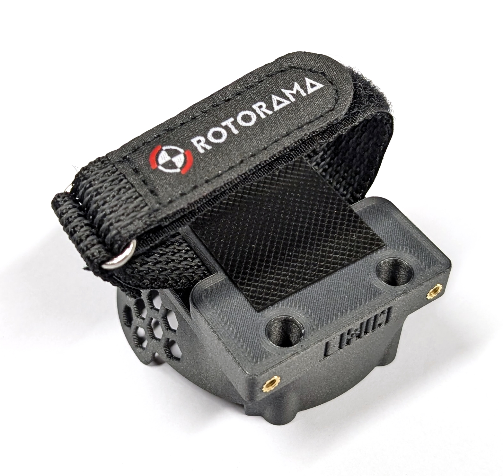
    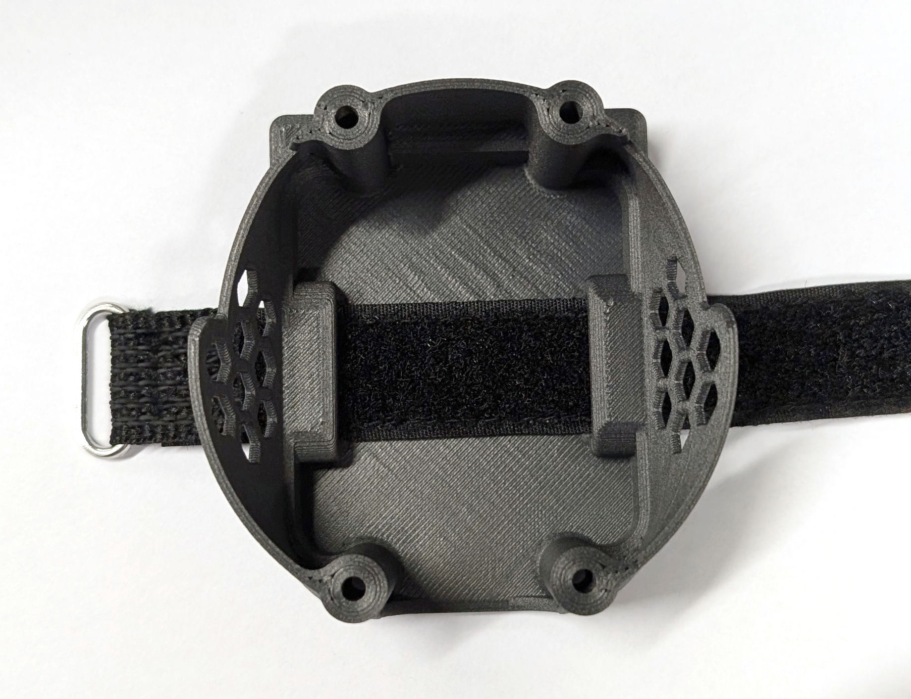
    
Fig. 33. Fully assembled battery holder (left) with inside view (right).

Save the remaining M3 x 25mm screws (BH-03) and M3 washers (BH-04) for the final assembly.

[Back to the top &#8593;](#table-of-contents)

### RC Receiver

In order to control a drone with an RC remote through the flight control unit (FCU), one needs to add an RC receiver to it. All parts for this subgroup are labeled with the prefix "RC-*" in the [bill of materials](./bill_of_materials.ods). The following steps demonstrate how to assemble the rc receiver mount.

    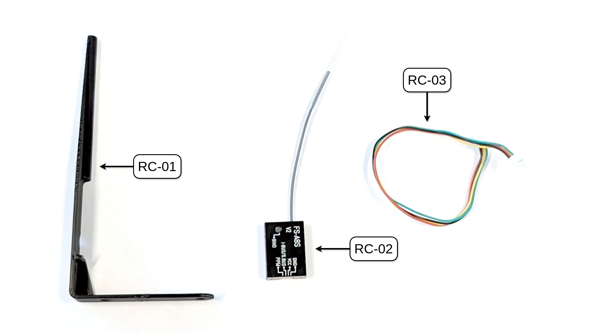
    
Fig. 34. All parts needed to mount the RC receiver to COMET.

[Back to the top &#8593;](#table-of-contents)

#### Connector Modification

To ensure the correct connection between the selected RC receiver (RC-02, [FlySky FS-A8S](https://www.flysky-cn.com/a8sspecifications?rq=FS-A8S)) and our chosen FCU (FC-01, [MicoAir H743 V2](https://micoair.com/flightcontroller_micoair743v2/), SBUS/CRSP port), it is necessary to modify the connector cable (RC-03). First, completely remove the green cable (one of the two outer cables) from both ends of the connector. Next, remove the yellow cable from one connector and insert it into the spot where the green cable was (connecting the SBUS/i-BUS signal to the FCU input). Attention: This step may differ depending on the FCU and RC receiver combination. Please refer to the respective user manuals for more information!

    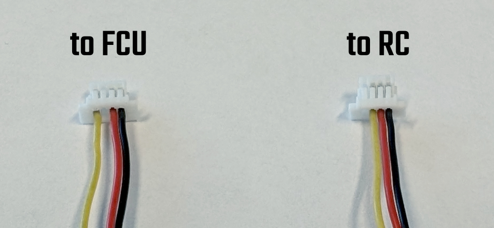
    
Fig. 35. Modified RC connector cable: (left) FCU end; (right) RC end.

[Back to the top &#8593;](#table-of-contents)

#### Preparation RC receiver

Apply a small cut piece of the double-sided tape (often include in the packkage), and ensure that the status LED of the receiver is not obstructed.

    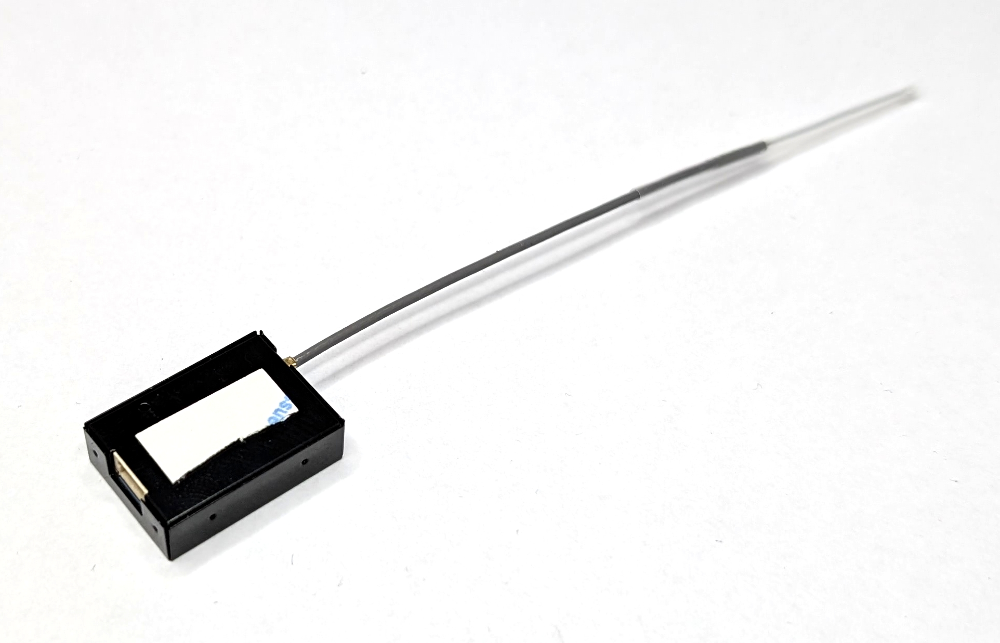
    
Fig. 36. Double-sided tape applied to the RC receiver.

[Back to the top &#8593;](#table-of-contents)

#### Mechanical Assembly

To assemble the RC receiver mount, first connect the cable (RC-03) to the RC receiver (RC-02). Then, remove the protection film from the double-sided tape. Thread the antenna of the RC receiver into the tube-like retainer of the mount (RC-01) and stick the receiver to the mount. Make sure the receiver's connector sits on the "ledge" to avoid it getting loose. Finally, secure the cable and receiver with zip ties.

    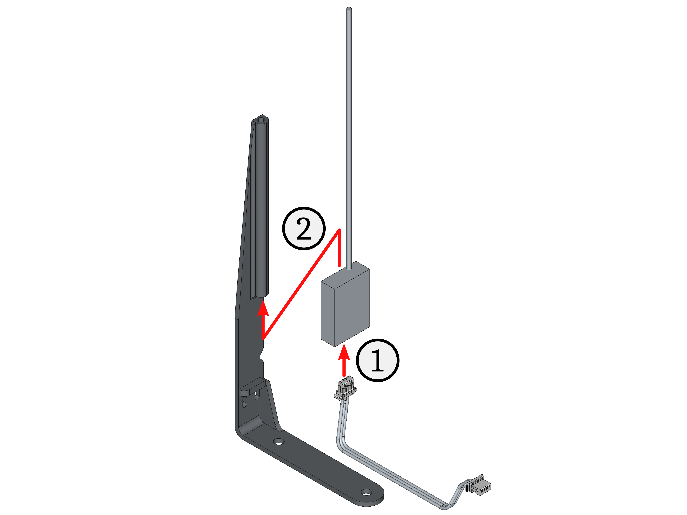
    
Fig. 37. Assembly steps of the RC receiver.

    
    
Fig. 38. Fully assembled RC receiver mount.

[Back to the top &#8593;](#table-of-contents)

### Y Frame

The most important step in the build is assembling the drone's frame because all of its components work together to make the drone fly. The FCU and ESC stack are mounted and connected to the frame. The motors and propellers will also be attached to it. Lastly, the frame carries the power supply in the form of a battery. The Y frame design is different from the conventional hexacopters. It provides redundancy in propulsion and allows for the carrying of front-heavy payloads. All parts for this subgroup are labeled with the prefix "YF-*" in the [bill of materials](./bill_of_materials.ods). The following steps demonstrate how to assemble the drone's frame.

    
    
Fig. 39. All parts needed to build the Y frame of COMET.

[Back to the top &#8593;](#table-of-contents)

#### Preparation of Parts

As with the landing gear, begin by melting the thread inserts (YF-06) into the bottom mounting plate (YF-01, only one piece), the XT30 connector mount (YF-03), the ESC connector mount (YF-04), and the quick release base (YF-05). Ensure the thread inserts are perpendicular to the surface and the right temperature is selected (e.g., PC CF 305°C).

    
    
    
Fig. 40. Example of how to best align the thread inserts for the bottom mounting plate (left). Prepared bottom mounting plate. All inserts should be flush with the bottom surface (right).

    
    
    
Fig. 41. Example of how to best align the thread inserts for the XT30 connector mount (left). The prepared XT30 connector mounts are mirrored (right). NOTE: UPDATE IMAGES

The ESC connector mount (YF-04) and the quick release bases (YF-05) have thread inserts that face the mounting plates turned upside down. This ensures proper alignment of the components when they are mounted to the mounting plate. As illustrated in the figures, insert them into the holes upside down (with the smooth part of the insert facing up) and push them in until the knurl is in the component. The smooth surface should stick out.

    
    
    
Fig. 42. Example of how to best align the thread inserts for the ESC connector mount (left). Prepared ESC connector mount (right).

    
    
    
    
Fig. 43. Example of how to align the thread inserts for the quick release base (left) correctly. Prepared quick release bases (middle) and a detailed look at the inverse thread inserts (right).

[Back to the top &#8593;](#table-of-contents)

#### Assembly top Mounting Plate

Start by adding the XT30 connector to the top mounting plate, which is the one without the thread inserts. Then, insert the pre-wired XT30 cables (YF-07) into the prepared XT30 connector mounts (YF-03). Attach them to the mounting plate using the M3 x 10 mm screws (YF-09) and M3 washers (YF-08). Note that both XT30 mounts are mirrored.

    
    
Fig. 44. Assembly steps for the XT30 connector mounts on the top mounting plate.

To attach the quick release bases to the top mounting plate, align the protruding thread inserts with the mounting plate holes and push them in. Make sure the other thread inserts point outward. Then, secure them using the M3 x 25 mm screws (YF-10) and M3 washers (YF-08). The protruding threads of the screws allow the FCU to be mounted there.

    
    
Fig. 45. Assembly steps for the quick release bases on the top mounting plate.

Finally, insert the manufactured ESC connector cable from above into the cutout of the prepared ESC connector mount (YF-04). Secure it to the top mounting plate using M3 x 10 mm screws (YF-09) and M3 washers (YF-08). The cable goes to the back.

    
    
Fig. 46. Assembly steps for the ESC connector mount on the top mounting plate.

    
    
    
Fig. 47. Fully assembled top mounting plate. NOTE: UPDATE IMAGES

[Back to the top &#8593;](#table-of-contents)

#### Assembly bottom Mounting Plate

Next, take M3 x 30 mm screws (YF-11) and screw them into the thread inserts of the bottom mounting plate from the non-flush side.

    
    
Fig. 48. Assembly steps for the ESC stack mount on the bottom mounting plate.

    
    
Fig. 49. Fully assembled bottom mounting plate. Note, the screws extend beyond the surface of the mounting plate.

[Back to the top &#8593;](#table-of-contents)

#### Mechanical Assembly

The final step for this subgroup is to combine the mounting plates with the rotor arms (YF-02) to complete the Y frame of COMET. First, insert the remaining M3 x 25 mm screws with M3 washers through the rotor arm mounting holes in the top mounting plate, which holds the XT30 connectors, ESC connector, and quick release base. Then, attach the rotor arms to the top mounting plate using these M3 x 25mm screws. Finally, put the bottom mounting plate at the bottom of the stack. Thread the XT30 and ESC connector cables through the center hole of the bottom mounting plate toward the ESC stack that will soon be mounted.

    
    
Fig. 50. Assembly steps for the rotor arms of the Y frame.

    
    
Fig. 51. Fully assembled Y frame of COMET. NOTE: UPDATE IMAGE

[Back to the top &#8593;](#table-of-contents)

### Putting COMET together

Now that all the subgroups are complete, it's time to assemble the drone. The Y frame is the base of this operation, and one subgroup will be added to it at a time.

#### Adding the Landing Gear

Align each of the three landing gear legs with the protruding M3 x 25 mm screws of the Y frame, making sure they are facing away from the center. Then, mount the legs to the Y frame with the screws.

    
    
Fig. 52. Assembly steps to attach the landing gear onto the Y frame.

[Back to the top &#8593;](#table-of-contents)

#### Adding the Motor Blocks

Next, slide a motor block onto one rotor arm. Orient the motor so that the self-locking nuts point downward. This makes maintenance easier since all the nuts and screws are on one side. After that step, take one M3 x25mm screw (MB-06) with one M3 washer (MB-07) that were left over and put them through the last mounting hole. Secure the connection from below with another M3 washer (MB-07) and one M3 self-locking nut (MB-08). All of the steps are depicted in Fig. 48 and need to be repeated three times.

    
    
Fig. 53. Assembly steps to attach the motor blocks onto the Y frame.

Before moving on to the next subgroup, it is helpful to label the motor connector cables. Proper control of the drone requires the motors to be in the correct order with respect to their positions and spinning direction. We chose to use the iNAV flight software's motor ordering scheme, which is illustrated in Fig. 54.

    
    
    
Fig. 54. The iNAV based motor order scheme <a href="https://github.com/iNavFlight/inav-configurator/blob/master/resources/motor_order/y6.svg">[source]</a> (left) and the correspondance to COMET (right).

[Back to the top &#8593;](#table-of-contents)

#### Adding the ESC Stack

Turn the entire assembly upside down to more easily mount the ESC stack, route the motor cables, and solder the remaining MR30 connectors. Push the ESC connectors to the top and the XT30 connectors' cables to the the bottom right to easily connect them to the power pads on ESC #2  (see Fig. 56, top left). Put the ESC stack onto the four M3 x 30mm screws and secure it with the stored M3 self-locking nuts (ES-08). Be sure that the labels on the motor pads of motors #1 and #2 are facing left, as shown in Fig. 56. Ensure the capacitor holder is flush with the mounting plate and that no cables are pinched. Finally, connect the ESC connectors to ESC #1 and ESC #2, respectively.

    
    
Fig. 55. Assembly steps to attach the ESC stack onto the Y frame.

    
    
Fig. 56. Result of the finished assembly step.

Next, add the female MR30 connectors (ES-06) to the motor cables. First, route the motor cables according to the labels on the motor blocks. Fig. 57 and 58 illustrate the best way to do this. The motor cables for motors M1 and M4 run left (M4) and right (M1) of the landing gear leg on the back. Use a zip tie as shown in Fig. 57 to hold them in place, but do not tighten it yet to allow for movement of the cables. Do this for the remaining M2, M3, M5, and M6 cables according to Fig. 58 too.

    
    
Fig. 57. This is an example of how to route motor cables M1 and M4 with a ziptie.

    
    
    
Fig. 58. This is an example of cable routing of the motor cables M3 and M6 fixed with a zip tie. It shows the front-side view (left) and back-side view (right). The routing is mirrored for M2 and M5 on the other rotor arm.

To solder the MR30 female connector to one motor cable bundle (M1 - M6), first cut the bundle to length by holding it against the front end of the male MR30 connector on the respective BLDC motor. Cut the cables and strip about 3 mm of insulation from each wire. Apply solder to the exposed wires and the connector’s solder cups. Slide the three motor wires through the MR30 female connector’s solder cover (the gray piece), then solder the wires to the cups (connector receptacle). Make sure there are no shorts between wires or pins, and check the joint by gently pulling on the connector while holding the cable. Push the solder cover onto the connector until it clicks into place, then connect the male and female MR30 connectors. Repeat for the remaining five connectors.

    
    
    
    
Fig. 59. The process of soldering the female MR30 connector onto the motor cables from the ESCs: (left) Cut the cable to the desired length using the BLDC motor's MR30 connector as a reference; (middle) solder the wire and connector together; and (right) the finished connector. NOTE: TAKE IMAGES

Finish by soldering both XT30 connector cables to the positive (red) and negative (black) power pads of ESC #2. If you have a multimeter that measures conductivity, check that the XT60 and both XT30 connectors have the same polarity.

    
    
Fig. 60. XT30 connector cables soldered to ESC #2. NOTE: UPDATE IMAGE

To complete this step, secure the motor connector cables to each rotor arm with a zip tie around the middle of the arm. Tighten all other zip ties used in this subgroup. This will prevent the cables from getting caught in the rotors and causing the drone to crash.

    
    
Fig. 61. Zip tie applied to the middle of the rotor arm. NOTE: UPDATE IMAGE

[Back to the top &#8593;](#table-of-contents)

#### Adding the Battery Holder

Place the prepared battery holder over the wired ESC stack and attach it to the bottom mounting plate using the remaining M3 x 25mm screws (BH-03) and M3 washers (BH-04). Ensure that the XT60 cable and any other cables are not pinched or damaged in the process.

    
    
Fig. 62. Assembly steps attach the battery holder onto the Y frame.

[Back to the top &#8593;](#table-of-contents)

#### Adding the RC receiver

First, remove the two M3 x 25mm screws and M3 washers securing the landing gear leg next to the XT60 power connector. Place the prepared RC receiver mount on top of the mounting plate, aligning the mounting holes. Finally, secure the RC receiver mount and the landing gear leg to the Y frame using the M3 x 25mm screws and M3 washers again.

    
    
Fig. 63. Assembly step attach the RC receiver onto the Y frame

[Back to the top &#8593;](#table-of-contents)

#### Adding the Handle

To attach the handle (CC-01) to the Y frame, slide it down from above onto the top mounting plate, aligning its mounting holes with the threaded inserts of the XT60 mounts (YF-03). Make sure the top pointer of the handle is aligned with the mounting holes on the top mounting plate, as seen in Fig. 63. Finally, secure the handle with the remaining two M3 x 10mm screws and M3 washers (YF-09 and YF-08).

    
    
    
Fig. 64. Assembly step to attach the carry handle onto the Y frame (left) and detailed look at the handle alignment (right).

[Back to the top &#8593;](#table-of-contents)

### Final Checks

- The motor wires are strain-relieved and kept clear of the propellers.
- There is no wobble, and the parts are secured firmly.
- All power connections have correct polarity.
- There are no exposed strands, and the joints are shiny and mechanically sound.
- The FC is isolated via soft mounts.
- The battery strap is tight, and the pad prevents slippage.
- The center of gravity is acceptable with minimal pitch bias.

[Back to the top &#8593;](#table-of-contents)

## Finished Build

Congratulations! You successfully built COMET! Great job! 😃

    
    
    
Fig. 65. A fully assembled COMET in a FreeCAD (left) and in reality (right). NOTE: UPDATE RIGHT IMAGE

[Back to the top &#8593;](#table-of-contents)
