<!-- SPDX-License-Identifier: CC-BY-SA-4.0 -->

# 3D-Print Guide

This guide covers the pre-print calibration, materials and settings, printing steps, and post-processing of the COMET frame and its accessories.

Find the needed files here:
- Slicer projects (recommended to use): [mechanical/prints/](./../mechanical/prints/)
- Meshes (STL): [mechanical/exports/stl/](./../mechanical/exports/stl/)
- Interchange solids (STEP): [mechanical/exports/step/](./../mechanical/exports/step/)

Naming of the 3MF projects inside the slicer project folders:
- Clearance gauge for pre-print calibration: `clearance-gauge-*.3mf`
- A single print plate is used for all COMET frame parts: `frame-*.3mf`
- Non-functional colored parts: `color-coding-*.3mf`

## Table of Contents
- [Clearance Gauge Calibration](#clearance-gauge-calibration)
- [3D Printing](#3d-printing)
- [Post-Processing](#post-processing)
- [Next Step](#next-step)

## Clearance Gauge Calibration

To achieve precise hole clearances, flat first layers, and accurate dimensions, calibrate the printer with the intended filament. For more information, consult the manufacturer's manual or look into these helpful sources:
- [Prusa Basic Calibration](https://help.prusa3d.com/category/basic-calibration_228)
- [Detailed 3D Printer Calibration](https://teachingtechyt.github.io/calibration.html)

Printer calibration is only effective to a certain extent, and some tolerances still remain. This step attempts to address the remaining uncertainty through the proper selection of clearances. This repository provides a test print part to determine the necessary clearance values for threaded inserts, M2 and M3 screws, and frame parts to ensure a proper fit. The source can be found in the [mechanical/source/tools](./../mechanical/source/tools/) folder, named `clearance_gauge.FCStd`. We recommend using it for the frame print, and it is optional for color-coded parts.

<div align="center">
    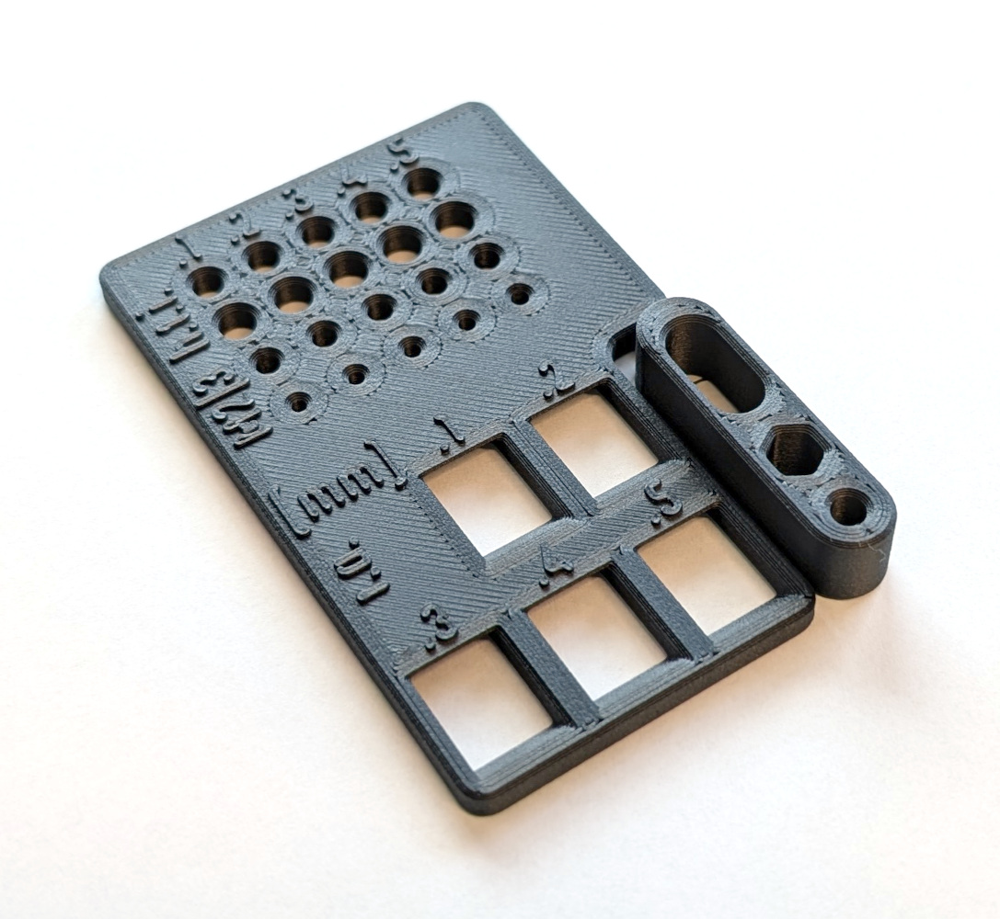
    <p>Fig. P-1. The clearance gauge printed in PC CF on our research group's Prusa CORE One 3D printers</p>
</div>

[Back to the top &#8593;](#table-of-contents)

### 1) Print the Clearence Gauge

First, find the outer and knurl diameters (`threaded_insert_outer_diameter` and `threaded_insert_knurl_diameter` in the parameters file) and minimum wall thickness (`threaded_insert_minimum_thickness` in the parameters file) of the M3 threaded inserts on the manufacturer's datasheet ([example](https://www.ruthex.de/cdn/shop/files/1Tabelle.PT05_eb2a30fa-5c34-46f8-b557-a6c432354560.jpg)), or measure them with calipers. Enter these values into lines L12, L13, and L14 in section "[1] Pre clearance gauge test values" of the part's parameter file [mechanical/source/part_parameters.yaml](./../mechanical/source/part_parameters.yaml).

To proceed, apply the current part parameters and ensure that all exports and slicer projects are up to date by using the following commands in the cloned repository's root folder:

```bash
freecad.cmd -c scripts/apply_parameters.py
freecad.cmd -c scripts/export_source.py
```

Print the clearance gauge using either the 3MF project `clearance-gauge-*.3mf` from a supported slicer and printer setup (look into [mechanical/prints/](./../mechanical/prints/)), OR use the exported STL or STEP files (look into [mechanical/exports/](./../mechanical/exports/)) to set up your own project.

[Back to the top &#8593;](#table-of-contents)

### 2) Determine Clearances

Once the print is complete, take one threaded insert, one M2, and one M3 screw (the length of the screws does not matter) from the ordered parts. Use the clearance gauge to determine which clearance your printer and filament combination needs for each part category, and note these values down for later.

Insert each part into the corresponding test hole one at a time. Each "row" is a different test, and the "columns" represent increasing clearance values in millimeters from left to right. Aim for a smooth, non-loose fit for the clearance holes and a firm, pressable fit for the insert pilots.

<div align="center">
    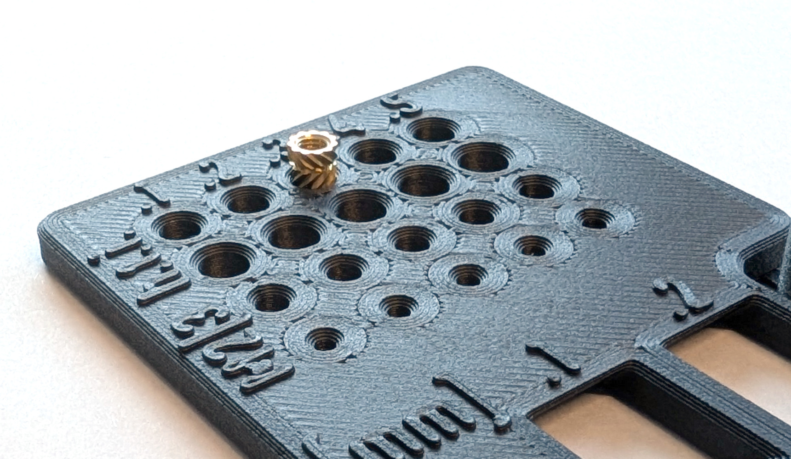
    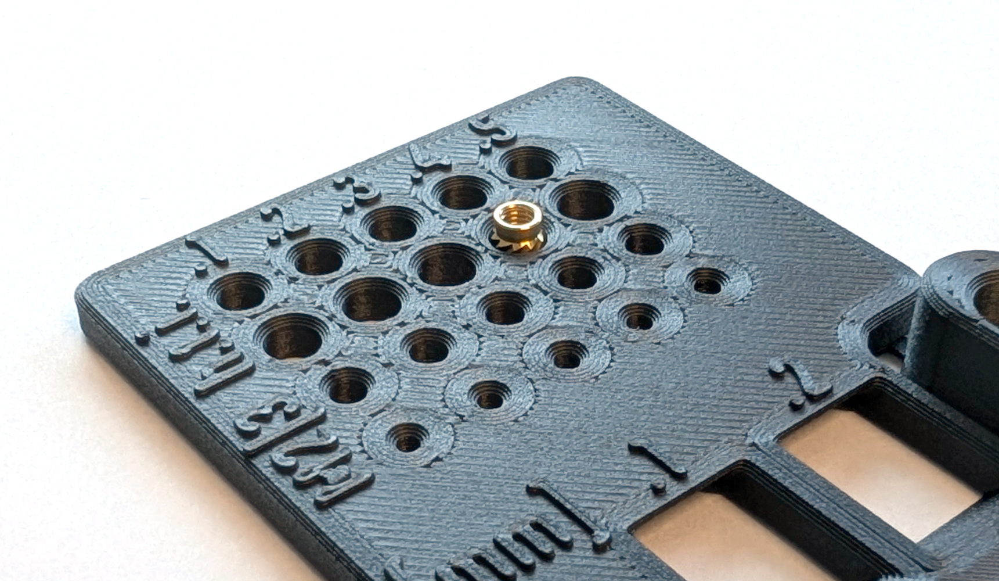
    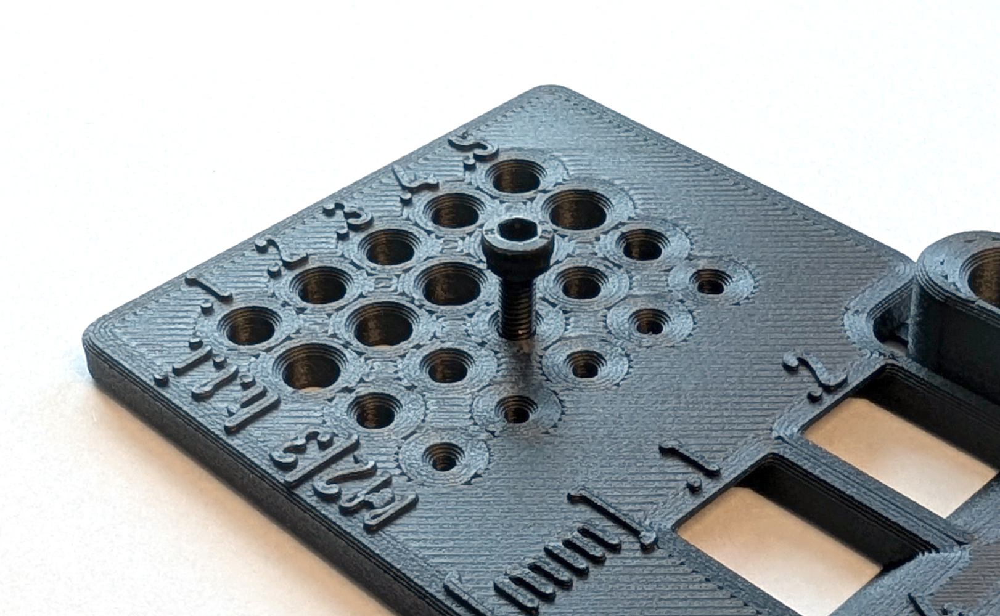
    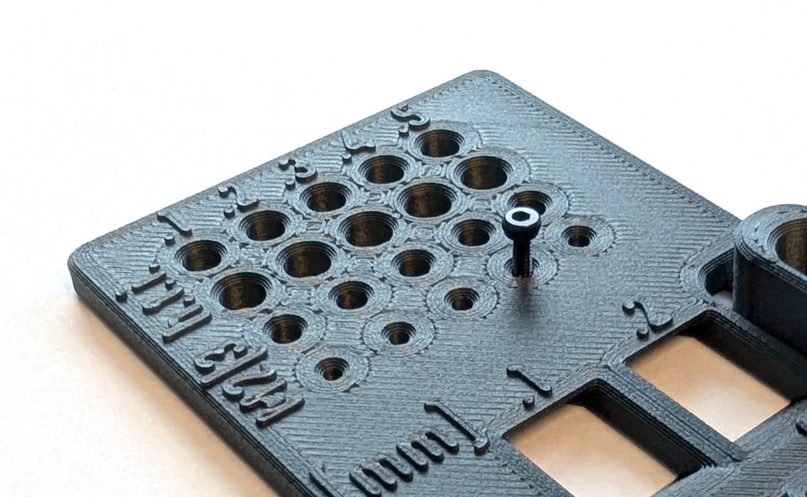
    <p>Fig. P-2. Testing the smooth side of the threaded insert in row 1 (top left), the knurled side of the threaded insert in row 2 (top right), the fit of the M3 screws in row 3 (bottom left), and the fit of the M2 screw through hole in row 4 (bottom right).</p>
</div>

The last test is for fitting the rotor arms together with the landing gear mount to form the landing gear of COMET. This is the only occasion where 3D prints are put together, so care must be taken. A small rotor arm test piece is included in the clearance gauge and can be broken off. Try inserting this piece into the square holes that emulate the landing gear mount. Again, aim for a smooth, non-loose fit. Note this clearance value as well.

<div align="center">
    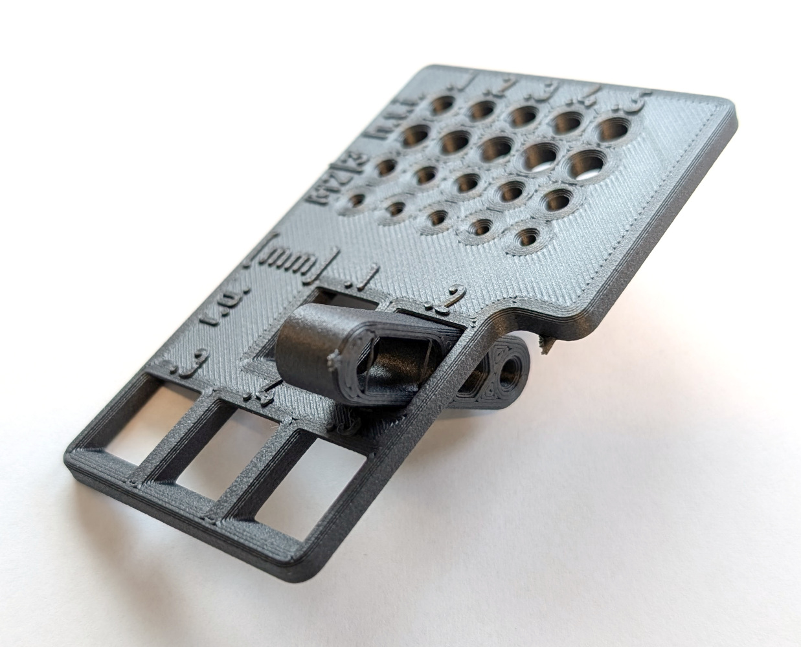
    <p>Fig. P-3. Testing the fit and clearance of the rotor arm and landing gear mount.</p>
</div>

[Back to the top &#8593;](#table-of-contents)

### 3) Update the Project

Use the resulting values and change lines L21, L23, L25, and L27 in section "[2] Values based on clearance gauge results" of the part's parameter file [mechanical/source/part_parameters.yaml](./../mechanical/source/part_parameters.yaml). You may want to adjust the value of the `elephant_foot_chamfer` parameter in line L4 to compensate for a potentially remainig elephant foot in your prints. This value determines the size of the chamfer applied to the bottom of every 3D-printed part.

Again, apply the current part parameters and ensure that all exports and slicer projects are up to date by using the following commands in the cloned repository's root folder:

```bash
freecad.cmd -c scripts/apply_parameters.py
freecad.cmd -c scripts/export_source.py
```

Everything is now ready to print with proper clearances.

[Back to the top &#8593;](#table-of-contents)

## 3D Printing


Pre-dry the filament: PC is highly hygroscopic. Before printing, ensure your Filament Dryer is set to 80\text{ }\text{\textdegree C} and dry the spool for 4 to 6 hours.

Use 3MF projects in hardware/mechanical/exports/3mf/ or follow manifest.csv.
STL/STEP are in hardware/mechanical/exports/{stl,step}/.
Follow docs/printing.md for materials, orientation, and post‑processing.

0) ensure that 3D printer calibration for elephant foot and over-/under-extrusion is done!
- See the section [Printed Parts](#printed-parts) for material and settings.
- Follow instructions
- STL and 3MF files are in hardware/exports/ and hardware/prints/3mf/.
- See mechanical/prints/README.md for recommended materials, orientations, and slicer profiles.
- Download STL/STEP: mechanical/exports/{stl,step}/
- Optional: use provided 3MF projects for a known-good profile.

- Verify printed parts match dimensions (critical hole diameters, arm thickness).


- Recommended materials:
  - PC-CF or ABS for the drone's frame (separte 3mf project file)
  - PETG for color-coding/cosmetic parts (separte 3mf project file)
- Baseline settings (see part notes and screenshots in docs/printing/):
  - Nozzle: 0.4 mm
  - Layer height: 0.2 mm (first layer 0.3mm)
  - Perimeters: 4
  - Top Solid layers: 6
  - Bottom Solid layers: 6
  - Infill: 20% Gyroid
  - Cooling: minimal for PC‑CF/ABS (just enough for bridges); normal for PETG
  - Orientation: each STL is oriented “as printed”
- Slicer profiles:  
  Provided 3MF projects for [PrusaSlicer](https://github.com/prusa3d/prusaslicer) in hardware/prints/3mf/ with per‑category settings.
- Heat‑set inserts: sizes and temperatures in part notes (docs/printing/) - README.md
- Post‑processing in hardware/prints/README.md (threaded inserts); post‑processing (reaming, tapping, heat‑set insert temperatures); removal of support.

- Files:
  - Editable: hardware/freecad/parts/*.FCStd
  - Interchange: hardware/exports/step/*.step
  - Mesh: hardware/exports/stl/*.stl
  - Slicer projects: hardware/prints/3mf/

Printed parts
- See ../../hardware/mechanical/exports/stl/ and manifest.csv for settings
- Recommended materials: PC/CF (frame), and PETG (color-coding parts)
2) Verify filament profile, nozzle, layer height, and cooling match the baseline above or the embedded profile.
1) Print parts according to manifest and 3MF projects.
2) Install heat-set inserts (where specified).

- Use the 3MF projects to capture intended orientation, supports, and modifiers.
- Typical settings (starting point; see manifest.csv for part-specific):
  - Nozzle: 0.4 mm; Layer: 0.20 mm
  - Walls: 4; Top/Bottom: 6; Infill: 35-50% (gyroid) for arms
  - Material: PC/CF-Nylon
- Tolerances (rule of thumb):
  - Write values in params/default.yaml
- Test coupons: test/coupons/ includes hole ladders and insert gauges.

Quality checks after printing
- Critical thickness (arms/plates) within ±0.2 mm of nominal.
- M3 fasteners pass freely through clearance holes after light reaming (if needed).
- No layer splits, especially near screw bosses and arm roots.

<div align="center">
    
    <p>Fig. P-4. The finished 3D-printed frame parts were produced using our research group's Prusa CORE One 3D printers. This build plate contains all the (functional) parts needed to assemble COMET.</p>
</div>

### Bill of Prints

[Back to the top &#8593;](#table-of-contents)

## Post-Processing

The final step is post-processing, which involves removing the supports and applying the threaded inserts. For the latter, gather all of the ordered threaded inserts together.

**Important note:** Wear PPE (a respirator/dust mask and nitrile gloves) during this step, as glass and carbon fiber dust can splinter from the parts and become airborne, entering your skin and lungs. If possible, avoid sanding or scraping the parts, as this can increase the probability of particles becoming airborne.

[Back to the top &#8593;](#table-of-contents)

### 1) Correct Print Defects

Take a good look at the 3D-printed parts, e.g., check the general quality and look for layer separations. You can find a list of potential print defects and how to fix them [here](https://www.simplify3d.com/resources/print-quality-troubleshooting/). Severe defects may require printing some part again.

[Back to the top &#8593;](#table-of-contents)

### 2) Remove Supports

3D printing often requires support structures that hold the molten plastic in position during printing (e.g., for overhangs). The amount, placement, density, and size of these supports often vary depending on the slicer software and print settings used.

In order to further process the printed parts, those supports must first be removed. The battery holder (BH-01) and the ESC connector mount (YF-04) will have supports attached to them. Depending on your slicer settings, support structures may also be present on the RC receiver mount (RC-01) and the XT30 male connector mounts (YF-03). These supports can be broken off by applying a small amount of force with a nose plier.
<div align="center">
    
    <p>Fig. P-5. Shows places where supports need to be removed.</p>
</div>

[Back to the top &#8593;](#table-of-contents)

### 3) Apply the Threaded Inserts

Threaded inserts will be used throughout the build for easier assembly. These get melted into the 3D-printed parts using a soldering iron with optional melting-aiding tips (see the tool list). If you have never worked with these type of threaded inserts before, this [tutorial video](https://www.youtube.com/watch?v=P7nHyI1TwKY) may be helpful. A note on the video: We achieved the best results with a temperature 15°C above the 3D printing temperature. For example, PC CF is printed at 290°C in our profiles; therefore, the temperature should be set to arround 305°C. 

Support the 3d-printed part on a flat surface and align the threaded insert with the hole. The threaded insert's smooth surface should easily fit as the tolerances were calibrated before. Then, hold the soldering iron tip against the insert. Once the insert is heated up, push it into the part until it is flush with the surface. This usally does not require much force. During this procedure, keep the soldering iron perpendicular to the surface (or vertical) to ensure the inserts are not at an angle. Note that the threaded inserts and the surrounding plastic will get hot and need to cool down.

[Back to the top &#8593;](#table-of-contents)

#### a) Preparation of the Landing Gear Mounts

**Repeat** the steps shown in the figure below **three times** for the full landing gear set.

<div align="center">
    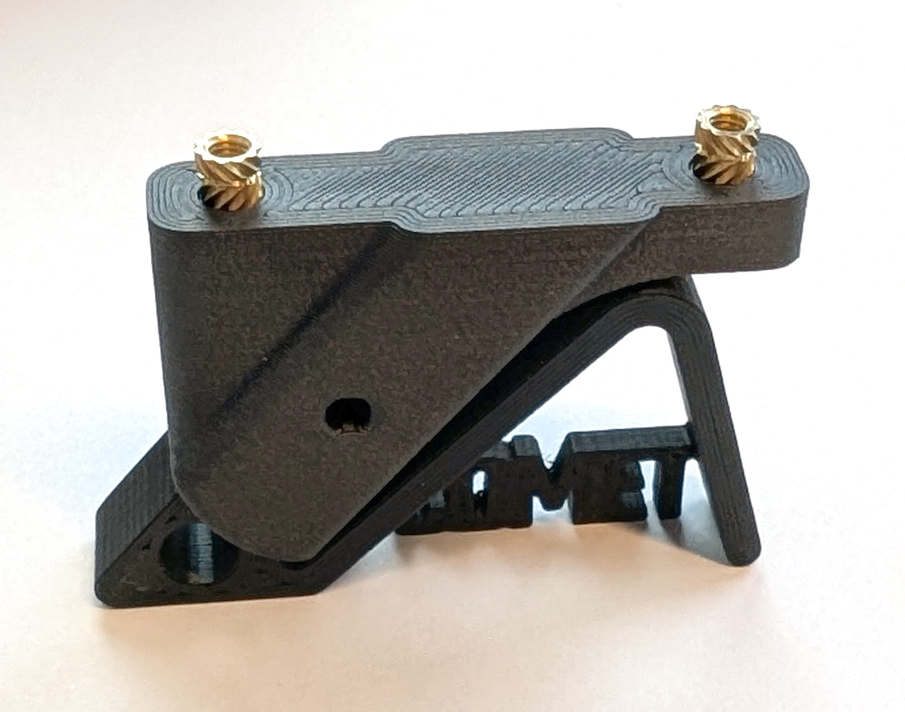
    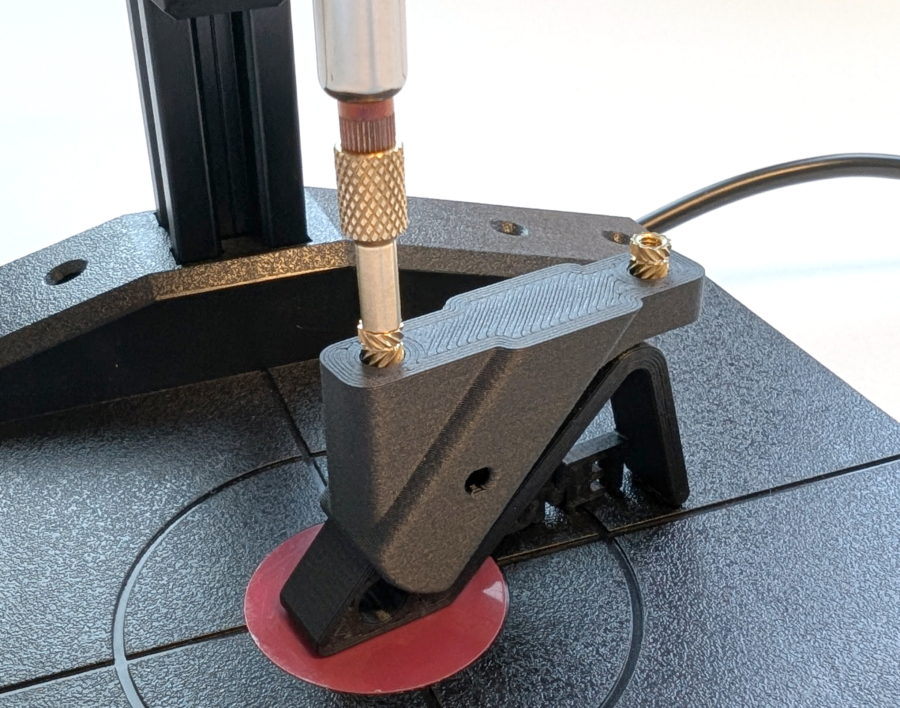
    
    <p>Fig. P-<b>X</b>. The images show how to best align the threaded inserts for the landing gear mount (left), how to best apply the heat through the soldering iron (middle), and the finished preparation of the landing gear mount (right).</p>
</div>

[Back to the top &#8593;](#table-of-contents)

#### b) Preparation of the Rotor Arms (Landing Gear Legs)

**Repeat** the steps shown in the figure below **three times** for the full landing gear set.

<div align="center">
    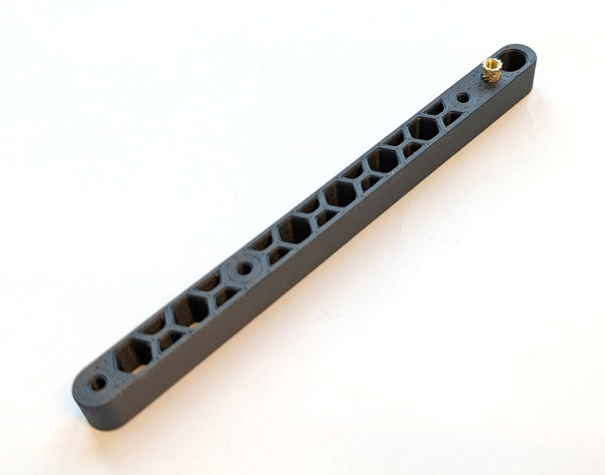
    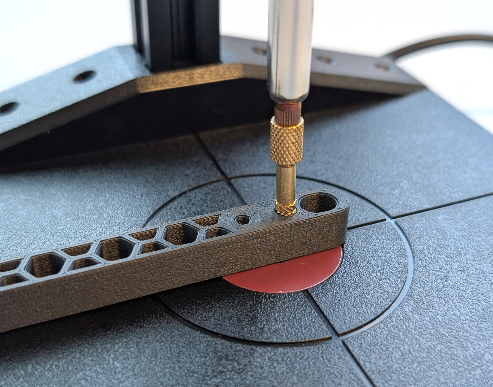
    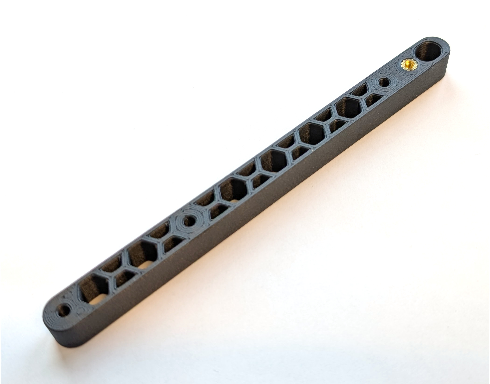
    <p>Fig. P-<b>X</b>. The images show how to best align the threaded inserts for the rotor arm (left), how to best apply the heat through the soldering iron (middle), and the finished preparation of the rotor arm (right).</p>
</div>

[Back to the top &#8593;](#table-of-contents)

#### c) Preparation of the Battery Holder

<div align="center">
    
    
    <p>Fig. P-<b>X</b>. The images show how to best align the threaded inserts for the battery holder (left) and the finished preparation of the battery holder (right). The soldering iron applies heat and force the same way as with the 3D prints of the landing gear.</p>
</div>

[Back to the top &#8593;](#table-of-contents)

#### d) Preparation of the Mounting Plate

**Do** the steps shown in the figure below **only one time**. Even though two mounting plates were printed, the second one remains without threaded inserts.

<div align="center">
    
    
    <p>Fig. P-<b>X</b>. The images show how to best align the threaded inserts for the one mounting plate (left) and the finished preparation of the bone mounting plate (right).</p>
</div>

[Back to the top &#8593;](#table-of-contents)

#### e) Preparation of the XT30 Male Connector Mounts

**Repeat** the steps shown in the figure below **two times** for both XT30 male connector mounts used.

<div align="center">
    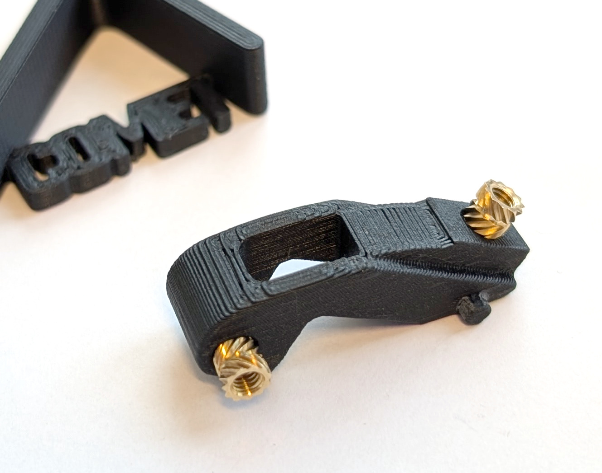
    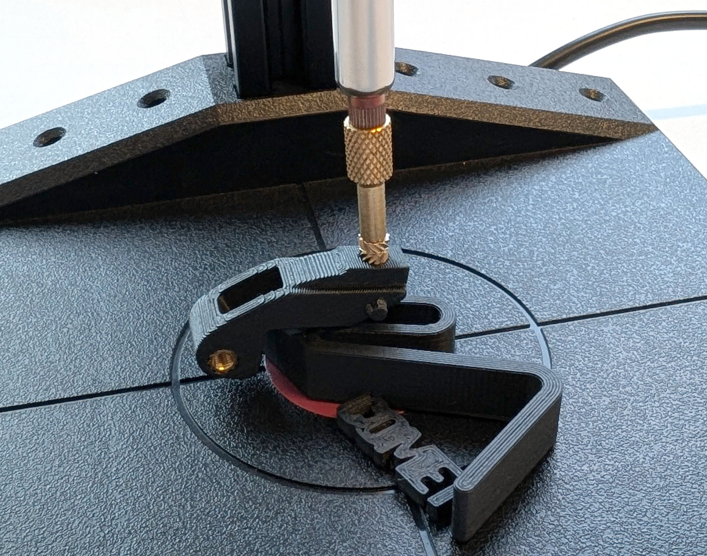
    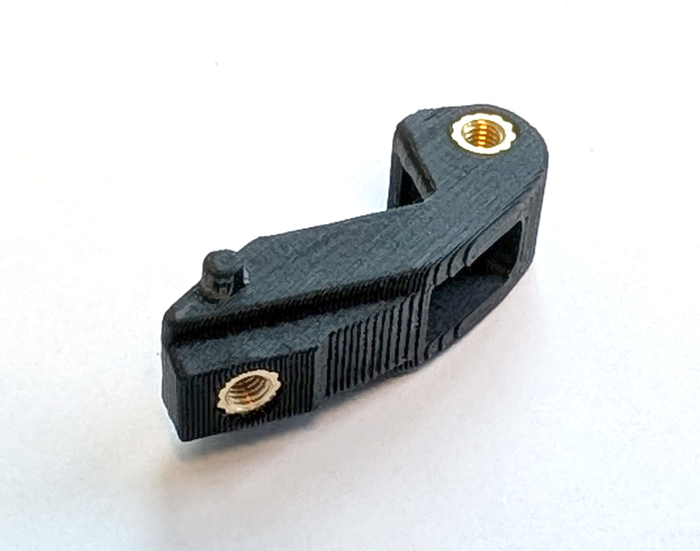
    <p>Fig. P-<b>X</b>. The images show how to best align the threaded inserts for the XT30 male connector mounts (left), how to best apply the heat through the soldering iron using the included helper (middle), and the finished preparation of the XT30 male connector mounts (right).</p>
</div>

[Back to the top &#8593;](#table-of-contents)

#### f) Preparation of the Quick Release Bases

The quick release bases (YF-05) have thread inserts that face the mounting plates turned upside down (Fig. P-<b>X</b>. left image shows that for the top two threaded inserts). This ensures proper alignment of the components when they are mounted to the second mounting plate. As illustrated in the figure, insert them into the holes upside down (with the smooth part of the insert facing up) and push them in until the knurl is in the component. The smooth surface should stick out (Fig. P-<b>X</b>. right image).

**Repeat** the steps shown in the figure below **two times** for both quick release bases used.

<div align="center">
    
    
    
    <p>Fig. P-<b>X</b>. The images show how to best align the threaded inserts for the quick release bases (left) and the finished preparation of the quick release bases (right). The soldering iron applies heat and force the same way as with the 3D prints of the quick release bases.</p>
</div>

[Back to the top &#8593;](#table-of-contents)

#### g) Preparation of the ESC Connector Mount

The ESC connector mount (YF-04) also has thread inserts that face the mounting plates turned upside down as well (Fig. P-<b>X</b>. left image shows that for the top two threaded inserts). As with the quick release bases, insert them into the holes with the smooth part of the insert facing up. Push them in until the knurl is in the component and just the smooth surface sticks out (Fig. P-<b>X</b>. right image).

<div align="center">
    
    
    <p>Fig. P-<b>X</b>. The images show how to best align the threaded inserts for the ESC connector mount (left) and the finished preparation of the ESC connector mount (right). The soldering iron applies heat and force the same way as with the 3D prints of the ESC connector mount.</p>
</div>

[Back to the top &#8593;](#table-of-contents)

## Next Step

Assemble COMET using the build manual in [`docs/build.md`](./build.md).

[Back to the top &#8593;](#table-of-contents)